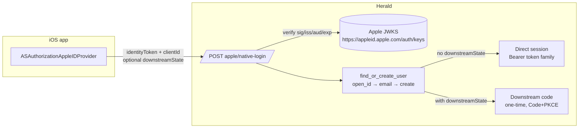

An integrator's iOS app raises the system authorization sheet via Apple's native SDK (`ASAuthorizationAppleIDProvider`), receives an Apple-issued `identityToken` (JWT), and POSTs it to Herald for verification. The user never leaves the app and there is no browser redirect. Herald only validates the credential — it does not call Apple's token endpoint and never touches `client_secret`.

This is a backend-only capability. Herald itself ships no iOS app; the iOS side is implemented by the integrator. The Herald web console is unchanged — the existing Apple provider config (Client ID, enabled state) is reused.

## Who this is for

Integrators adding Apple sign-in to an iOS app, and anyone who wants to understand how this path coexists with the Apple web redirect login and Google One Tap. This is not an API reference — for endpoint and schema details see the [OpenAPI reference](/docs/openapi).

## What problem it solves

Until now Apple login had only the web redirect path (OAuth Authorization Code redirect): the user leaves the app, bounces through a browser, and comes back. The experience is disjointed, and the web redirect path depends on `client_secret` — a JWT signed with an Apple private key, which has runtime-signing and 6-month renewal overhead.

The native path sidesteps both. The iOS app gets the `identityToken` directly from the system SDK; Herald verifies signature, issuer, audience, and expiry against Apple JWKS on the server, then issues a session. The app never touches an Apple private key, and Herald never calls Apple's token endpoint or uses `client_secret`.

It is architecturally identical to Google One Tap: receive an upstream-issued JWT credential → verify server-side → match the user → issue in one of two branches. The only differences are that the credential comes from Apple and the email handling rule is different (see below).

## Prerequisites

The native path only reads the existing Apple provider config. It adds no new settings.

- The realm has an enabled Apple provider (US-OE-001). If not, the endpoint returns 404 `"Apple provider not configured or not enabled"`.
- The integrator's iOS app has the Sign in with Apple capability enabled in Apple Developer, and its audience matches the Apple provider's Client ID (Service ID) configured in the Herald realm.

The existing Apple provider form fields in the Herald console (Client ID, scopes, enabled) are sufficient for the native path.

## Two session branches

Whether the request carries `downstreamState` selects the branch. This is the same mechanism used by Google One Tap and the OAuth callback.

**Direct session branch (omit `downstreamState`).** The iOS app corresponds to a first-party Client App in Herald. On success Herald issues a Bearer token family bound to `clientId` (`accessToken` / `refreshToken` / `expiresIn`, …), the same shape returned by password login and the OAuth callback.

**Downstream authorization-code branch (include `downstreamState`).** The iOS app integrates via Authorization Code + PKCE (a third-party Client App). On success Herald issues a one-time authorization code and returns a `redirectUri` containing `?code=ac_...&state=...`; the integrator then exchanges the code at the existing token endpoint using the PKCE verifier.

## The request

`POST /api/oauth/{realmId}/apple/native-login` — a public endpoint; access is gated by the Apple `identityToken` passing verification.

| Field | Type | Required | Notes |
|---------|------|----------|-------|
| `identityToken` | string | yes | Apple-issued ID Token (JWT) from the `ASAuthorizationAppleIDProvider` callback |
| `clientId` | string | yes | The Herald Client App `client_id` initiating login; selects the app the direct-session token family binds to |
| `downstreamState` | string | no | Downstream authorization transaction id (OAuth `state`). Present → downstream-code branch; absent → direct-session branch |

The direct-session branch returns `message` + `userId` + a Bearer token set (`accessToken` / `refreshToken` / `expiresIn` / `refreshExpiresIn` / `tokenType`), the same shape as the OAuth callback. The downstream-code branch returns `{ redirectUri }` carrying the one-time code and the original state.

## What the iOS side does

Herald owns none of the iOS code; this just describes the contract. The iOS app raises the system sheet, obtains the `identityToken`, picks a branch, and submits the result to Herald.

1. Start an `ASAuthorizationAppleIDRequest` via `ASAuthorizationAppleIDProvider`; set `requestedScopes` to `[.fullName, .email]` as needed (email and name are returned only on the first authorization).
2. In the callback, read `ASAuthorizationAppleIDCredential.identityToken` (a JWT) and decode it to a string.
3. Pick a branch:
   - First-party: pass `clientId` only, omit `downstreamState`.
   - Third-party Code+PKCE: the user must first initiate a downstream authorization transaction at Herald's `/authorize` to obtain a `state`, which you send as `downstreamState`.
4. `POST` to `/api/oauth/{realmId}/apple/native-login`; handle the returned token set or exchange the code for tokens.

After the first authorization, Apple never returns email or name again. That is Apple's behavior, and the email handling rule below exists because of it.

## Email handling

The Apple native email rule **intentionally differs** from the Apple web redirect login. The reason: Apple never returns an email after the first authorization, so copying web redirect's "reject when email is missing" would make a returning user's first native login fail.

- **Apple relay address** (`@privaterelay.appleid.apple.com`) is a real, deliverable mailbox; store it as the user's real email, not a placeholder.
- **No email in the credential + no existing provider record for this `sub`** (first-time account creation): synthesize `{sub}@apple.placeholder` with `verified=false` and create the account. This mirrors the WeChat placeholder pattern (`{id}@wechat.placeholder`).
- **No email + `sub` matches an existing provider record** (returning user): matched by `open_id`, email is not consulted.

`account.email` has a NOT NULL + unique constraint; the placeholder exists to satisfy that constraint on first creation so login is not blocked.

## Account consistency

The native and web redirect paths use the same match key: `provider_type=Apple`, `open_id=Some(claims.sub)`. So an Apple user who logged in via web redirect and then via native resolves to the same Herald account — no duplicates. The match priority matches every other OAuth login: `open_id → email → create` (Apple provides no union_id).

## Failure responses

| HTTP | Condition | Notes |
|------|-----------|-------|
| 400 | Body validation failed (missing `identityToken` / `clientId`); `downstreamState` invalid, already consumed, or bound to a mismatched transaction | `bad_request` |
| 401 | `identityToken` signature / issuer / audience / expiry validation failed | `unauthorized`; no account or session is created |
| 404 | Realm has no Apple provider or it is disabled | `"Apple provider not configured or not enabled"` |
| 503 | Apple JWKS unreachable (infrastructure failure) | `"Upstream service unavailable"`; verification is never silently skipped |

JWKS unreachable returns 503, not 401: a 401 would wrongly blame the caller for an upstream outage. Herald never degrades to "skip signature verification" when JWKS cannot be fetched.

## Security rules

These are enforced by the backend, not suggestions.

- **Credential stays out of logs.** tracing records only `realm_id`, `provider=apple`, `user_id`, and failure category; the `identityToken` plaintext never enters a span field.
- **Audience is bound to the realm.** The `identityToken` `aud` must equal the realm's Apple provider `client_id`; a cross-realm credential is rejected.
- **`client_secret` is never exposed.** The native path does not use `client_secret` at all; neither the response nor the provider-config read touches the secret field.
- **Session is client-bound.** The direct-session branch binds to `clientId` and follows the existing IP-binding policy, consistent with password login, the OAuth callback, and Google One Tap.

## Relation to other login paths

- **Apple web redirect login** (live): the two entry points coexist and resolve to the same Apple user. The web redirect `client_secret` auto-signing defect is independent; the native path neither depends on it nor fixes it.
- **Google One Tap**: structurally identical (JWT credential → server-side verification → two-branch issue). Differences: Apple does not require `email_verified == true` to proceed (the placeholder rule covers it), and Apple's `iss` is the single value `https://appleid.apple.com`.
- **Other providers** (GitHub, Facebook, WeChat, …): coexist without interference.

## Related docs

- [Apple native login PRD](https://github.com/timzaak/herald/blob/main/docs/prd/auth/support-mobile-apple-login.md) — product scope, business rules, acceptance goals
- [Apple native login user stories](https://github.com/timzaak/herald/blob/main/docs/user-stories/auth/support-mobile-apple-login.md) — US-AL-001..003 acceptance scenarios
- [Third-party backend integration](/docs/third-party-integration) — overall context for downstream Code+PKCE and Bearer tokens
- [OpenAPI reference](/docs/openapi) — endpoint and schema details
