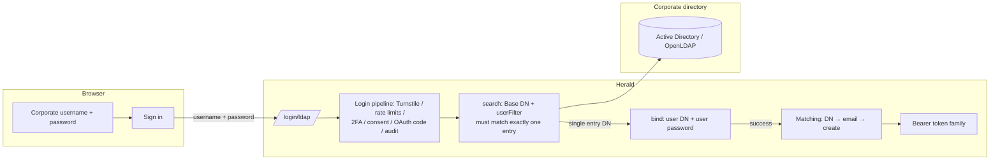

Herald's LDAP login lets employees sign in with the username and password they already have in the corporate directory (Active Directory, OpenLDAP, any LDAPv3 directory). A Realm Admin configures the directory connection under *Settings*, a corporate-account entry appears on the login page, and the first successful login provisions an account with no local password. The directory is only the credential authority: Herald never writes to or syncs the directory.

This is a first-factor login method. After the directory authenticates the employee, everything downstream is the same pipeline a password login runs through: Turnstile, rate limiting, TOTP/Passkey second factor, legal consent, downstream authorization codes, session issuance.

## Who this is for

Realm Admins who want employee identities owned by the corporate directory, and developers integrating the hosted auth pages or building a Custom User UI who need the request shape and error branches. It is not an API reference — for endpoint and schema details, see the [OpenAPI reference](/docs/openapi).

## What problem it solves

Employees already have a directory account. Making them register a separate Herald password means two sets of credentials and two places to manage them. LDAP login hands the "verify the password" step to the directory; Herald keeps the account record and the authorization.

A common setup is closing the Realm's public self-registration and letting employees sign in through the directory. Herald treats the first login accordingly: enabling the directory is the admin's authorization for that provisioning, so the first successful directory authentication creates the account regardless of the public-registration switch.

## How it works

Two public endpoints:

1. **Status.** `GET /api/auth/{realmId}/ldap/status` returns `{ enabled }`. A frontend needs no admin permissions to show or hide the corporate-account entry. A Realm with no configuration returns `false`, not a 404.
2. **Login.** The user submits a corporate username and password. The frontend posts `{ clientId, username, password, turnstileToken?, oauthClientId?, redirectUri?, state?, agreements? }` to `/api/auth/{realmId}/login/ldap`.

Authentication is standard search-then-bind: Herald searches under the Base DN with the configured user filter, using the service account (or anonymously, if the directory allows it). The search must return exactly one entry; Herald then binds to the directory with that entry's DN and the user's password. Zero hits or more than one hit both fail authentication — Herald never binds against a guessed entry.

The password boundaries are deliberate: the corporate password travels only over an encrypted channel, is never stored, and is discarded after verification. Request validation does not apply the local password policy (8–36 characters) because directory password policy belongs to the corporate admin; the only limit here is a 512-character cap for abuse control.

A successful login returns the same two shapes password login uses: final success is a `BrowserTokenResponse` (`accessToken`/`refreshToken`/`expiresIn`), and intermediate steps return the flag shape (`requiresTotp`, `consentRequired` with the agreement list, `redirectTo` in OAuth flows). Frontends reuse their password-login handling as is.

Error semantics:

| Status | Condition | Notes |
|--------|-----------|-------|
| 401 | No such user in the directory, wrong password, search returned 0 or >1 entries | Always the same generic invalid-credentials response as password login; the response cannot enumerate directory accounts |
| 400 | LDAP not enabled for the Realm | No account or session is created |
| 403 | Directory authentication succeeded but the Herald account is disabled | Explicit disabled-account message |
| 429 | Rate limit hit | Shares the same IP + identifier budget as password login; the threshold does not drop for LDAP |
| 503 | Directory unreachable or timing out | The whole search-then-bind sequence has a 10-second cap; the response carries no directory address or internal detail, the full error goes to tracing and audit |

Rate limiting, Turnstile, and second factors are inherited from the existing login pipeline; a frontend cannot bypass them.

## Realm configuration

Realm Admins configure this under the *Corporate directory (LDAP)* tab in *Settings*. Permissions match the rest of Settings: reading takes `settings.view`, saving takes `settings.manage`.

The configuration lives in two `configType=ldap` rows: `settings` (JSON) and `bind_password` (the service-account password, treated as a secret). Fields of `settings`:

| Field | Required | Notes |
|--------|----------|-------|
| `enabled` | Yes (default false) | The sole enablement signal; both the status endpoint and the login gate read only this |
| `url` | Yes | Directory address starting with `ldap://` or `ldaps://` |
| `starttls` | No (default false) | Must be true for `ldap://`; must be false for `ldaps://` |
| `baseDn` | Yes | Starting DN for the user search |
| `bindDn` | No | Service-account DN; empty means anonymous search (requires the directory to allow it) |
| `userFilter` | Yes | Search filter template; must contain exactly one `{login}` placeholder |
| `mailAttribute` | No (default `mail`) | Directory attribute carrying the email |

Save-time validation is strict: an unencrypted connection (`ldap://` without StartTLS) is rejected outright, because corporate passwords may only travel over an encrypted channel. The filter must have balanced parentheses and exactly one `{login}`; the username the user typed is escaped before substitution, so it cannot inject filter syntax.

Two real filter examples:

- Active Directory: `(&(objectClass=user)(sAMAccountName={login}))` with `ldaps://ldap.example.com:636` and `dc=example,dc=com`.
- OpenLDAP: `(&(objectClass=inetOrgPerson)(uid={login}))` over `ldap://` with StartTLS, like the repo's test directory at `dc=herald,dc=test`.

`bind_password` reads back masked (`configValue` is null); submitting it empty keeps the stored password. The form's "save the service-account password before enabling with a bind DN" guard is this semantics.

There is one more field, `caCertPem`: when the directory's certificate is issued by a private CA, you can submit a PEM certificate bundle (up to 32 KB). The trust is added on top of the system trust store, not a replacement. This field is only settable through the configs API — the Settings form has no input for it.

## First-login provisioning

On the first successful directory authentication, Herald matches accounts in three steps: directory identity (the user entry DN) → email → create. The directory identity is stored as an identity link (type `ldap`), so later logins resolve to the same account.

- The email coming back from the directory is maintained by the corporate admin, so Herald treats it as trusted. An employee who registered with that email before the directory was connected gets the directory identity linked to the existing account on first login — no duplicate account.
- When the directory has no mail attribute, the account is created with a placeholder email derived from a hash of the DN (the `@ldap.placeholder` domain, not marked verified). Later logins match by directory identity and never depend on the email.
- Provisioned accounts have no local password. Trying that account's email with any password in the password form gets the same generic failure as a wrong password; setting a local password later restores password login.
- When the Realm requires legal consent, the login returns the `consentRequired` branch before creating the account. The user consends, the frontend resubmits with the agreement versions, and the consent is recorded before the account exists.

Provisioning is not gated by the public-registration switch, for the reason above: enabling the directory is the provisioning authorization.

## Relationship to other login methods

LDAP is a parallel first-factor option; it disables nothing:

- Password, email code, and first-factor Passkey entries stay available. Disabling the directory hides the entry and rejects logins with 400; existing accounts and their other login methods are untouched.
- TOTP and Passkey second factors still apply. A user with TOTP bound authenticates against the directory first, then completes TOTP.
- When a third-party app initiates the login, the request carries `oauthClientId`, `redirectUri`, and `state`; after authentication the existing authorization-code branch runs and the app receives tokens the same way it would from a password login.
- Tokens issued on success use the same family semantics as every other method: refresh rotation, reuse detection, revocation.

On the frontend, the login page shows the entry fail-closed (it renders only when `enabled === true`; a failed status query also hides it). Browser integrations call the web SDK's `loginWithLdap`, which returns the same result shape as `login`.

Turnstile runs per Client App, same as email-code login; see [Custom User UI](/docs/custom-user-ui).

## What it deliberately does not do

These are boundaries, not backlog:

- No LDAP-group-to-Herald-role mapping and no background directory sync. Those are separate projects if needed.
- No Windows desktop single sign-on (SPNEGO/Kerberos); login-page form authentication only.
- One directory configuration per Realm; no multi-directory failover.
- No credential caching. When the directory is unreachable, corporate login is unavailable (503); employees use other login methods and the admin can disable the directory in Settings to stop the bleeding.
- No password proxying. Corporate password changes and resets go through the directory's own channels; Herald never writes to the directory.

## Related docs

- [Email code (OTP) login](/docs/auth-email-otp) — the other alternative first factor; same status-endpoint and entry-visibility pattern
- [Custom User UI](/docs/custom-user-ui) — the build-your-own-frontend path, including Turnstile rendering and token storage
- [Configuration](/docs/configuration) — realm settings and the generic config-row read/write
- [OpenAPI reference](/docs/openapi) — details and schemas for the `ldap_login` and `ldap_status` endpoints
