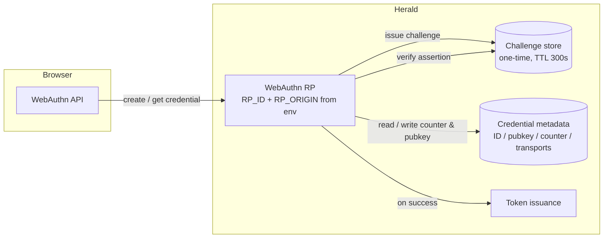

Herald's Passkey support is built on WebAuthn / FIDO2. The same credential works as a passwordless first factor (conditional UI) and as a second factor after password login. Password and TOTP are always kept as fallbacks so a lost device or an unsupported browser never locks a user out.

## Who this is for

Developers and Realm Admins who need to understand or turn on Passkey in a Realm. It covers what Passkey does in Herald, how the two login modes behave, how Realm policy and user device management work, and the security rules the implementation enforces. It is not an API reference — for endpoints and schemas, see the [OpenAPI reference](/docs/openapi).

## What problem it solves

Passkey is a public-key credential that stays on the user's device. The private key never leaves it, and the assertion is bound to the origin (RP_ID), so a phishing page on a look-alike domain cannot produce a valid assertion. Passkey is an additional option alongside TOTP — it does not replace it, and both remain available as fallbacks.

## Two login modes

One Passkey credential serves both modes. This is a deliberate design choice: a user who registers a Passkey does not have to think about "is this a login credential or a 2FA credential" — it is both.

**First factor (passwordless).** On the login page, the browser auto-fills any discoverable credential the user has registered on this browser (conditional UI) when the username field is focused, or the user clicks *Use Passkey*. The server issues a fresh assertion challenge, the device signs it, and on success a Bearer token is issued directly — no password is ever entered.

**Second factor.** The user enters email and password. After the password verifies, if the user has a registered Passkey, Herald offers a Passkey verification step alongside TOTP. The user completes the ceremony and a Bearer token is issued. This mode parallels the existing TOTP second-factor flow.

In both modes the outcome on success is the same token issuance path TOTP uses.

## Realm configuration

Realm Admins control Passkey under *Settings → Security*. The configuration reuses the same Realm-config storage TOTP uses, so there is no separate Passkey settings surface to learn.

| Setting | Meaning |
|---------|---------|
| `enabled` | Whether Passkey is offered at all in this Realm. Off → the registration entry point and the login option are hidden |
| `force_enabled` | When on, users without a Passkey are nudged to register one on next login. The fallback to password / TOTP is still kept, so a user is never locked out by a missing device or unsupported browser |
| `user_verification` | `preferred` or `required`. Applies to both registration and authentication ceremonies under this Realm |
| `cross_platform_authenticator` | Whether roaming authenticators (YubiKey, a phone as a cross-device credential) are accepted. Defaults to allowed to stay compatible with common synced-passkey ecosystems (iCloud Keychain, Google Password Manager) |

Disabling Passkey after users have registered is a graceful degradation: new registrations are blocked, but existing credentials keep working and those users can still fall back to password / TOTP. No one is forced off their existing Passkeys.

## User device management

A user can register multiple Passkeys and manage them under *Profile → Security*. Each credential carries:

- a device name (a default like "iCloud Keychain" or the authenticator name, editable by the user)
- registration time and last-used time
- whether it is a syncable passkey (sync passkey)

Rename and delete are both supported. Deleting the **last** Passkey is gated by an explicit risk prompt: the user must confirm they understand they will only be able to log in with password / TOTP afterward. A deleted credential is immediately unusable; if it was the last one, conditional UI no longer surfaces for that user.

Passkey registration requires the current password to be confirmed first, matching the existing convention for security-sensitive operations.

## Fallback and degradation

Herald never implements a "passwordless-only" mode. Every Passkey surface keeps a fallback:

- On the login page, *Use password instead* is always reachable.
- If a browser does not support WebAuthn, the Passkey entry point is hidden and only password / TOTP login is shown.
- If a Passkey ceremony fails, the message is a unified "Passkey verification failed" with a retry and a fallback to password — the specific failure reason is never exposed, to avoid leaking which step failed.
- Under `force_enabled`, users without a Passkey are guided to register one but can still skip and use password / TOTP.

TOTP, when enabled, is itself a fallback after password login. The two are presented as parallel second-factor options, not a priority-ordered chain.

## Security rules the implementation enforces

These are not suggestions; the backend rejects ceremonies that violate them.

- **Challenge is one-time and short-lived.** Each registration and authentication challenge has a 5-minute (300s) TTL and is deleted immediately after it is consumed, whether the ceremony succeeds or fails.
- **Origin and RP_ID are checked.** The assertion's origin must match the deployment's `RP_ID` / `RP_ORIGIN`. These come from environment configuration, not hard-coded, so the same build serves different deployment domains.
- **Counter is monotonic per credential.** Every successful authentication updates the stored counter and rejects non-increasing values, to detect credential cloning.
- **Only metadata is stored server-side.** The server keeps the credential ID, COSE public key, counter, transports, aaguid, backup eligibility/state, and the user-chosen nickname. The private key never leaves the user's device and is never persisted server-side.
- **Failure reasons are not leaked.** Verify failures return a single generic message.
- **Rate limiting.** The Passkey registration and authentication endpoints are subject to the same rate-limit policy as the existing login / authentication endpoints.
- **Auditing.** Key events are written to the audit log: successful registration, credential deletion, Realm policy changes (including force-mode changes), and Passkey login success / failure.

## Data flow

Both the first-factor and the second-factor path reuse the same RP, challenge store, and credential store; they differ only in whether the ceremony runs before or after password verification, and which temp-session key the challenge is anchored to.

## Related docs

- [Passkey PRD](https://github.com/timzaak/herald/blob/main/docs/prd/auth/passkey.md) — product scope, business rules, and acceptance goals
- [Passkey user stories](https://github.com/timzaak/herald/blob/main/docs/user-stories/auth/passkey.md) — US-PK-001..010 acceptance scenarios
- [TOTP tutorial context](/docs/configuration) — TOTP is the shared fallback; Realm security config lives here
- [OpenAPI reference](/docs/openapi) — endpoint and schema details
