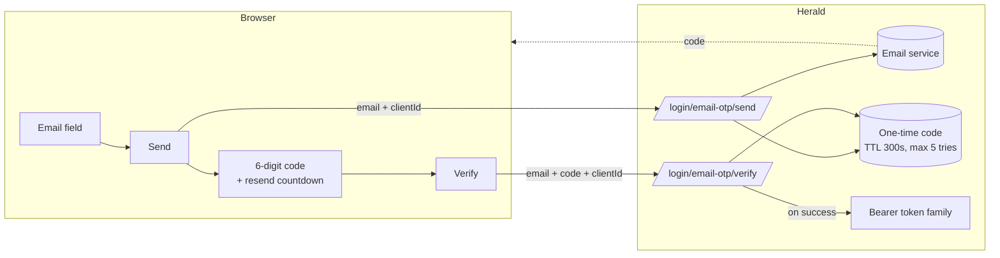

Herald's email-code login lets a user sign in by entering a one-time code sent to their email, with no password. A Realm Admin turns it on under *Settings*, and can let brand-new emails auto-register on first login. The code is short-lived, attempt-limited, and rate-limited per email and per IP. Password, TOTP, and Passkey remain available as alternatives.

This is a first-factor login method, not a second factor. TOTP and Passkey are still the second-factor options after a password login. Email-code login replaces the password step entirely for users who choose it.

## Who this is for

Realm Admins who want to offer passwordless sign-in, and developers integrating the hosted auth pages or building a Custom User UI who need to know the request shape and the branches the endpoints can return. It is not an API reference — for endpoint and schema details, see the [OpenAPI reference](/docs/openapi).

## What problem it solves

Some users do not want to manage a password, and some Realms would rather not store one at all. Email-code login trades a remembered secret for proof that the user controls the inbox. The trade-off is that the email provider becomes part of the trust path, and the inbox must be reachable at login time. Herald keeps password, TOTP, and Passkey as fallbacks, so turning email-code on never locks anyone out.

## How it works

The flow is two unauthenticated steps:

1. **Send.** The user enters their email. The frontend posts it to `/api/auth/{realmId}/login/email-otp/send`. If the email belongs to an active account, or auto-register is on, Herald emails a 6-digit code. The response carries `expiresInSeconds` so the frontend can show a countdown.
2. **Verify.** The user types the code. The frontend posts `{ email, code, clientId }` to `/api/auth/{realmId}/login/email-otp/verify`. On success the response is a `BrowserTokenResponse` (the same shape password login returns), and the frontend stores the tokens the same way.

The public endpoint `GET /api/auth/{realmId}/email-otp/status` returns `{ enabled }` so a frontend can hide or show the email-code entry without needing admin permissions.

Send returns `200` regardless of whether the email has an account or whether that account is active — a registered-but-disabled account gets a 200 and no code is mailed, so the response cannot be used to enumerate which inboxes exist. The only non-200 send responses are the two 409 branches described under *Realm configuration* below (`email_not_registered`, `consent_required`).

The `clientId` in both calls is the Client App the login belongs to. It determines the Turnstile site key (Turnstile is configured per Client App), the rate-limit bucket, and which browser token family is issued.

## Realm configuration

Realm Admins turn email-code on under *Settings → Security*, in the *Email code* tab next to TOTP and Passkey. The permission model is the same as the rest of Settings: reading requires `settings.view`, saving requires `settings.manage`.

| Setting | Meaning |
|---------|---------|
| `enabled` | Whether the email-code entry shows up on the login page for this Realm. Off → the entry is hidden and the send/verify endpoints reject with 400 |
| `autoRegister` | What happens when someone enters an email that has no account. On → the first successful code verify creates the account and logs them in (subject to the consent gate below). Off → send returns a 409 `email_not_registered` so the frontend can guide the user to register explicitly |

Email delivery requires the Realm to have an email provider configured under *Settings → Email*. If no provider is configured, the code cannot be sent; turning email-code on without email configured leaves the entry visible but the send failing.

### The consent gate (auto-register)

When `autoRegister` is on and the Realm requires agreement to legal documents (terms, privacy policy), the very first send for a brand-new email returns a 409 with `code: "consent_required"` and the list of required agreements — no code is mailed yet. The frontend renders the agreements, the user accepts, and the frontend re-sends with the accepted agreement versions. Only then is the code sent, and a successful verify both creates the account and records the consent.

This keeps consent before account creation. A user never gets an auto-registered account without having agreed to the required documents.

## Limits and rate limiting

These are enforced server-side; the frontend cannot relax them.

| Limit | Value |
|-------|-------|
| Code lifetime | 300 seconds (5 minutes) |
| Max verify attempts per code | 5 |
| Send rate limit, per email | 2 per 60 seconds |
| Send rate limit, per IP | 5 per 60 seconds |
| Verify rate limit, per email | 5 per 60 seconds |
| Verify rate limit, per IP | 10 per 60 seconds |

After 5 wrong codes the code is invalidated and the user must request a new one. A successful verify consumes the code; it cannot be replayed.

## Relationship to the other login methods

Email-code is a parallel first-factor option. It does not disable password, TOTP, or Passkey:

- **Password login** stays available. Users with a password can still use it.
- **TOTP and Passkey** are second factors that run *after* a password login. Email-code login does not require or trigger them — it is already a single-factor sign-in.
- **Passkey first-factor** (conditional UI) is a separate passwordless path. Both can be enabled at once; the login page shows each as its own entry.

A user who signs in by email code gets the same `BrowserTokenResponse` shape and the same token-family semantics (rotating refresh, reuse detection, revocation) as any other login method.

## Turnstile

Send is Turnstile-gated when the Client App has `turnstile_enabled` on. The frontend renders the widget, solves the challenge, and sends the resulting `turnstileToken` in the send request body. Verify does not require a fresh Turnstile token. See [Custom User UI](/docs/integration/custom-user-ui) for how Turnstile is configured per Client App.

## Related docs

- [Custom User UI](/docs/integration/custom-user-ui) — the self-built frontend path, including how to render the Turnstile widget and store the resulting tokens
- [White-label](/docs/customization/branding) — branding the hosted auth pages where the email-code entry also appears
- [Passkey Authentication](/docs/auth/passkey) — the other passwordless first-factor option
- [Configuration](/docs/configuration) — Realm security settings
- [OpenAPI reference](/docs/openapi) — endpoint and schema details for the send, verify, and status endpoints
