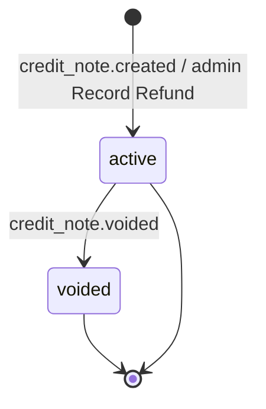

Herald's invoice system supports three sources: Stripe external sync, Creem MoR sync, and Herald self-issued (manual). A Credit Note records a refund voucher at the invoice level, so an invoice's "refunded amount" and "remaining payable" stay consistent with the actual money collected.

Stripe invoice refunds work in two layers: the Refund at the Charge layer is handled by `charge.refunded` for credits clawback; the Credit Note at the Invoice layer is handled by `credit_note.created` / `credit_note.voided` for invoice amounts. This feature covers only the latter. Creem is a Merchant of Record — tax compliance is Creem's responsibility, and Herald does not maintain Credit Notes. Offline refunds on manual invoices are recorded by a Realm Admin who manually creates a Manual Credit Note.

## Who this is for

Developers working on Herald's billing module, Realm Admins, and backend/frontend developers who need to understand the invoice-refund data flow.

## Credit Note lifecycle

Two fields decide a Credit Note's business meaning:

- `source`: `stripe` or `manual`. Stripe ones are synced from webhooks; Manual ones are created by an admin.
- `status`: `active` or `voided`. active means the refund has taken effect and is subtracted from the invoice's remaining payable; voided means Stripe voided the Credit Note, and the amount is added back to the remaining payable.

A Manual Credit Note is `active` the moment it is created, and cannot be revoked or deleted. If you record it incorrectly, the only path is offline compensation or a customer-service channel.



The invoice's own state machine is unaffected and remains `draft / issued / paid / void / overdue`. A Credit Note only overlays two derived display dimensions — "refunded" and "remaining payable" — on a `paid` invoice.

## Data model

The core entity is defined in `backend/domain/src/billing/credit_note.rs`:

```rust
pub struct CreditNote {
    pub id: Uuid,
    pub invoice_id: Uuid,
    pub realm_id: String,
    pub amount: i64,              // smallest currency unit, must be > 0
    pub currency: String,
    pub source: CreditNoteSource, // Stripe | Manual
    pub status: CreditNoteStatus, // Active | Voided
    pub external_credit_note_id: Option<String>, // Stripe only
    pub memo: Option<String>,     // Manual only
    pub created_by_user_id: Option<Uuid>, // Manual only
    pub created_at: DateTime<Utc>,
}
```

The invoice table caches two derived values:

- `amount_refunded`: cumulative refunded amount
- `amount_remaining`: remaining payable, equals `total - amount_refunded`

On write, a repository method updates both the `credit_note` table and these two fields on the invoice within a single transaction, to avoid a JOIN aggregate at list-query time.

## Stripe Credit Note sync

### Triggering events

You need to configure a webhook in the Stripe Dashboard so Herald receives these events:

- `credit_note.created`: creates a Credit Note with status `active`
- `credit_note.voided`: sets the Credit Note to `voided` and rolls back the amount

Event handling lives in `backend/api-billing/src/stripe_webhook_handlers.rs`.

### Idempotency and out-of-order handling

Stripe may send events more than once, and may send `credit_note.voided` before `credit_note.created`.

Handling rules:

- `credit_note.created` uses `stripe_credit_note_id` as the unique key. A duplicate event updates the existing record; it does not add the amount again.
- `credit_note.voided` first looks up the local record. If already `voided`, it is skipped; if it does not exist, the handler returns a 500 to trigger Stripe re-delivery, waiting for the `created` event to arrive first.
- When the linked invoice is not found locally, a Warn log is recorded and the event is skipped; a compensation job picks it up later.

### Compensation job

`backend/worker/src/jobs/webhook_compensation_job.rs` already includes `credit_note.created` and `credit_note.voided` in the Stripe event compensation list. When a webhook is missing, the job pulls recent events from the Stripe Events API and reprocesses them.

## Recording a Manual Credit Note refund

### Entry point

A Realm Admin clicks **Record Refund** on the invoice detail page, fills in the amount and reason, and submits.

The button only appears when all of these are true:

- `provider = manual`
- The invoice status is `paid`
- The current user has the `billing.manage` permission

### Constraints

- The amount must be a positive integer in the smallest currency unit (cents).
- A single amount cannot exceed the invoice's current remaining payable.
- The cumulative refund cannot exceed the invoice total.
- Only `provider = manual` invoices can have one created. Creating one on a Stripe or Creem invoice returns 403 with "Refunds for this provider are managed externally".

After a successful create, the invoice detail immediately shows the refund summary and the Manual Credit Note list.

### Relationship to voiding an invoice

If a manual invoice already has an active Credit Note, the admin cannot void it. `void_invoice` checks for active Credit Notes and returns 409:

```text
Invoice cannot be voided while it has active refund credit notes
```

Only voided Credit Notes do not block voiding — they are audit evidence only.

## Frontend display

### Admin view

The invoice list adds a **Refunded** column. When `amountRefunded > 0` and `provider` is stripe or manual, a source-colored chip is shown (Stripe is teal, Manual is cyan). Rows with `provider = creem` show an em dash.

The invoice detail page shows, under the fee summary:

- **Total**: the invoice total
- **Refunded**: cumulative refunded amount (red, negative)
- **Remaining**: remaining payable

If cumulative refunds exceed the total, a destructive alert is shown prompting the admin to reconcile in the Stripe Dashboard or audit the Manual records.

The detail page also shows a dual-track Credit Note list:

- **Manual track**: number, reason, operator, issue time, status, amount. A **Record Refund** button sits at the bottom.
- **Stripe track**: number, issue time, status, amount. Read-only, with a footnote "Read-only · managed in Stripe Dashboard".

A voided Credit Note row gets a strikethrough, but the `Voided` badge stays readable.

### User view

Regular users see only the refund summary (e.g. "Refunded 30/100") in their invoice list and detail; they do not see the Credit Note list, internal IDs, or operator info. Invoices with `provider = creem` show no refund dimension at all.

## Common edge cases

| Scenario | Handling |
|------|---------|
| Cumulative refund exceeds invoice total (Stripe side) | Error log; no auto-fix |
| Cumulative refund exceeds invoice total (Manual side) | Rejected at creation time |
| Creating a Manual Credit Note on a Stripe/Creem invoice | 403 rejected |
| Creating a Manual Credit Note on a non-`paid` invoice | 400 rejected |
| Local record missing on `credit_note.voided` | Returns 500 to trigger Stripe re-delivery |
| No linked invoice on `credit_note.created` | Warn log and skip; wait for the compensation job |
| Voiding an invoice with active Credit Notes | 409 rejected |

## Related docs

- `docs/prd/billing/notes.md` — Credit Note product requirements
- `docs/user-stories/billing/invoice-fallback.md` — US-IF-007 ~ US-IF-011
- [Invoice main flow](/docs/billing/invoice)
- [Stripe payment and webhooks](/docs/billing/stripe-payment)
- `docs/prd/billing/webhook-compensation.md` — Webhook compensation mechanism
