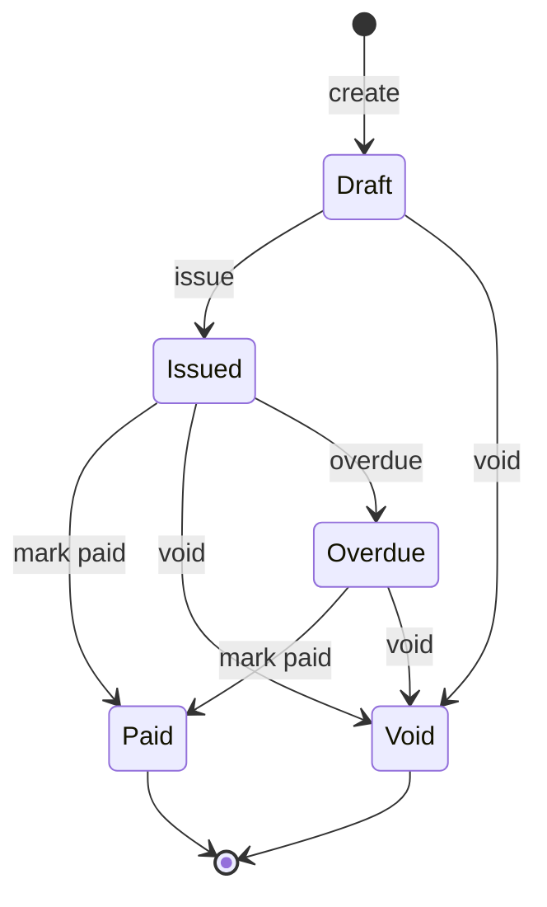

Herald supports two kinds of invoices: invoices created manually by admins, and invoices requested by users through self-service. Both share the same underlying data model, but differ in entry point and permissions.

Invoices produced by a payment provider (Stripe, Creem, etc.) are external invoices. Herald only stores a reference and a redirect link, and does not edit them.

## Invoice states

An invoice has five states, and the flow is one-directional (Void is terminal):

Allowed actions per state:

| State | Allowed actions |
|------|-----------|
| Draft | View, edit, issue, void |
| Issued | View, void, mark paid, download PDF |
| Overdue | View, void, mark paid, download PDF |
| Paid | View, download PDF |
| Void | View |

External invoices (provider is not manual) are view-only; editing and state changes are not supported.

## Admin actions

### Configure seller info

The invoice PDF displays the seller's info. Configure it before first use.

1. Find **Invoices** in the left menu and click in
2. Click **Seller Config** (or the gear icon)
3. Fill in the seller info:
   - Company name
   - Address
   - Tax ID
   - Contact info
   - Anything else to print on the invoice
4. Save

### Create an invoice

1. On the Invoices page, click **Create Invoice**
2. Fill the invoice form:
   - **Buyer info**: name, address, contact
   - **Line items** (at least one): description, quantity, unit price (in yuan; the system stores it as cents)
   - **Discount**: fixed amount or percentage
   - **Tax**: fixed amount or percentage
   - **Shipping**: fixed amount
   - **Payment terms**: e.g. "Net 30", "Due on Receipt"
   - **Due date**: optional
   - **Notes**: optional
3. The system computes subtotal, discount, tax, shipping, and total automatically
4. Click create; the invoice enters the **Draft** state

### Issue

Once a Draft invoice is confirmed correct, click **Issue**. The state becomes **Issued** and the system generates an invoice number.

After issuing, the invoice content cannot be modified. If you find an error, the only path is to void and recreate.

### Void

An invoice in Draft or Issued can be voided. Voiding is irreversible.

### Mark as Paid

An invoice in Issued or Overdue can be manually marked as paid. This is used for offline collection or when the provider has no automatic callback.

### Download PDF

Invoices in Issued, Paid, or Overdue support PDF download. The PDF is generated on the Herald server and contains the seller info, buyer info, line items, and totals.

## User-side actions

### View invoice list

After logging in, users see their own invoice list in the invoices page of the user center. This includes both admin-created invoices and invoices they applied for themselves.

### Apply for an invoice

A user can request an invoice for a completed payment:

1. On the invoices page, click **Apply for Invoice**
2. Fill in the invoice title info (name, tax ID, address, etc.)
3. On submit, a Draft invoice is generated; an admin can see and process it in the console

The `source` of a user-applied invoice is `user_application`; an admin-created invoice is `admin_manual`.

### Download PDF

A user can download PDFs for their own invoices, provided the invoice is in a downloadable state (Issued, Paid, Overdue).

## External invoices

Invoices produced by a payment provider (Stripe, Creem) are external invoices. Herald only stores basic info and a redirect link (`externalHostedUrl`); it does not generate a local PDF. WeChat Pay has no invoice API for third parties, so its transactions never enter the invoice system.

An external invoice shows a provider tag in the list (e.g. "Stripe"); clicking through redirects to the provider's own invoice page.

## Invoice attribution (payment → invoice mapping)

Beyond storing a provider reference and redirect link, an external invoice also records which local payment or subscription it belongs to. Reconciliation no longer requires reverse-engineering "which payment this invoice corresponds to" from an external ID.

Rules:

- On every successful third-party payment (including subscription renewals), Herald records a successful payment attempt and maps a paid invoice.
- Attribution: one-time-purchase invoice → the corresponding one-time payment attempt; subscription invoice (including renewals) → the corresponding subscription; a renewal invoice → both the renewal payment attempt and the subscription.
- Creem renewals previously synced only the first invoice; now every renewal period has one, aligned with Stripe renewals.
- A zero-amount period (100% discount or free tier) has no actual charge, so no renewal payment attempt is recorded and no renewal invoice is generated; the subscription period and credits still update as usual.
- Duplicate webhooks do not produce duplicate records; existing historical empty attribution is not backfilled — this applies only to newly synced invoices.
- Manual self-issued invoices are not required to carry attribution (gift invoices, offline payments, and similar no-payment scenarios allow empty attribution).

## How attribution anomalies surface

Two classes of anomalies are visible to admins, so that "successful payment but no invoice" or "invoice with no matching payment" do not linger silently:

- **Unattributed invoices**: the invoice list supports filtering with `?attribution=missing`; an unattributed external invoice row is tagged "no attribution". Manual self-issued invoices are excluded.
- **Successful payments with no invoice**: query the attribution-anomaly endpoint for payment attempts in the last 90 days that succeeded but have no associated invoice.

Admins see the full attribution info (subscription, payment attempt); regular users only see their own invoice summary, and invoice detail does not expose internal payment-attempt IDs.

The attribution-anomaly endpoint `GET /api/bill/{realmId}/invoice-attribution/anomalies` returns two lists: `unattributedInvoices` (unattributed external invoices, up to 100) and `paymentsWithoutInvoice` (successful payment attempts in the last 90 days with no invoice, up to 200). Each entry in the latter carries `paymentAttemptId`, `provider`, `amount`, `currency`, `completedAt`, and a `subscriptionId` that is always null (the payment-attempt table itself has no subscription column; the subscription association lives on the invoice side). Requires the `billing.view` permission.

## Invoice policy configuration

An admin can configure an Invoice Policy to control automatic invoice generation — for example, whether to auto-create an invoice after a successful payment, or the default payment terms.

The configuration entry is in **Policy Config** on the Invoices page.

## API overview

Admin invoice endpoints:

| Method | Path | Description |
|------|------|------|
| GET | `/api/bill/{realmId}/invoices` | Invoice list (supports `attribution=missing` to filter unattributed invoices) |
| POST | `/api/bill/{realmId}/invoices` | Create an invoice |
| GET | `/api/bill/{realmId}/invoices/{invoiceId}` | Invoice detail |
| PATCH | `/api/bill/{realmId}/invoices/{invoiceId}` | Update an invoice (Draft only) |
| POST | `/api/bill/{realmId}/invoices/{invoiceId}/issue` | Issue |
| POST | `/api/bill/{realmId}/invoices/{invoiceId}/void` | Void |
| POST | `/api/bill/{realmId}/invoices/{invoiceId}/mark-paid` | Mark as paid |
| GET | `/api/bill/{realmId}/invoices/{invoiceId}/pdf` | Download PDF |
| GET | `/api/bill/{realmId}/invoice-attribution/anomalies` | Attribution anomalies: unattributed invoices + successful payments with no invoice |
| GET/PUT | `/api/bill/{realmId}/invoice-seller-config` | Seller config |

Both the invoice list and detail responses carry the two attribution fields `subscriptionId` and `paymentAttemptId` (a renewal invoice carries both).

User invoice endpoints:

| Method | Path | Description |
|------|------|------|
| GET | `/api/bill/{realmId}/my/invoices` | My invoices |
| POST | `/api/bill/{realmId}/my/invoices` | Apply for an invoice |
| GET | `/api/bill/{realmId}/my/invoices/{invoiceId}` | Invoice detail |
| GET | `/api/bill/{realmId}/my/invoices/{invoiceId}/pdf` | Download PDF |
