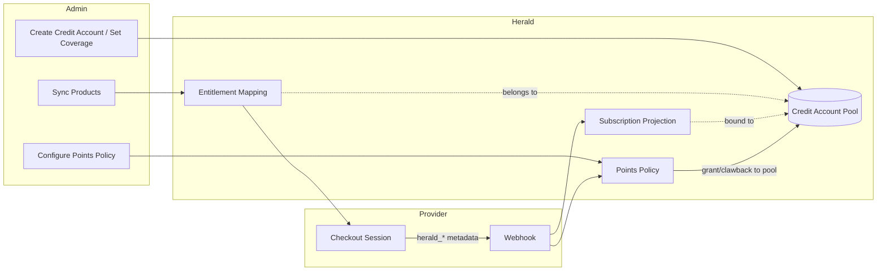

Herald's billing system does not keep a local product catalog. Payment providers like Stripe and Creem own Product, Price, Checkout, and the subscription lifecycle; Herald keeps only the minimum data needed for authorization and credit grants.

## The paywall loop

Everything in this module serves one goal: turning payments into a paywall that stays in sync on its own.

1. The user pays via Stripe, Creem, WeChat Pay, or an in-app purchase.
2. Herald resolves the purchase to an `entitlement_key` and grants credits into the bound Credit Account.
3. Your product checks that entitlement — or the credit balance — and lets the request through or blocks it.
4. Refunds and cancellations revoke the entitlement and claw the credits back automatically.

Free allowances and rolling quota windows ride on the same model, so freemium, subscriptions, and metered pricing all end in the same check.

## Who this is for

Developers who need to understand the design of Herald's billing module. It does not cover the hands-on integration steps for any specific provider — for those, see each provider's dedicated guide.

## Core concepts

### Credit Account

A Credit Account is the unit of isolation for credits. A Realm can have multiple Credit Accounts, each with an independent balance that does not affect the others. It solves this problem: a single Realm may run several business lines at once — say, an AI chatbot app and an image-generation app — and their credits must be settled and consumed separately, never mixed. Each Credit Account covers a set of Client Apps; only covered Client Apps can spend credits from this pool.

Payments grant into the Entitlement Mapping's bound account; registration and free-periodic credits are routed by the Realm's distribution rules. Balances are derived from a per-grant credit ledger and break down by the five credit types: top-up, subscription, registration, free-periodic, and granted. The full model — fields, constraints, the ledger, and the admin API — is covered in [Points Accounts](/docs/points/account); the spend side in [Points Consumption](/docs/points/consumption).

### Entitlement Mapping

An Entitlement Mapping is a table that maps a provider's external product ID to an internal Herald `entitlement_key`, and at the same time anchors it to a Credit Account. It is not a product catalog — it is an allowlist plus a sync cache.

Each mapping includes:

| Field | Description |
|------|------|
| `payment_provider` | Provider name (stripe, creem, apple, google, wechat) |
| `external_product_id` | Product ID on the provider side (e.g. `prod_xxxx`; store product ID for IAP) |
| `external_price_id` | Price ID on the provider side (Stripe has this; not applicable to Creem or IAP) |
| `entitlement_key` | Internal Herald entitlement identifier (e.g. `pro-plan`) |
| `bucket_id` | Owning Credit Account. After purchasing this product, credits go into this account's pool |
| `billing_type` | Billing type: Recurring, OneTime, or Non-renewing |
| `point_rules` | Points distribution rules owned by the mapping. Empty is valid — a role-only mapping or a pure payment record (validity and grant policy live on the rules) |
| `granted_role_ids` | Roles auto-granted on payment success. Empty = no role grant; see the [paywall configuration guide](/docs/points/paywall) |
| `enabled` | Whether it is enabled. When disabled, webhooks still update the subscription projection, but no credits are granted |

The mapping also carries a copy of display info synced from the provider (`provider_product_info`), read-only, used to show the product's original appearance in the admin console, not used for billing:

| Field | Description |
|------|------|
| Product name | The list and grouping use it as the primary label. When missing, falls back to the external product id, then a placeholder — never an empty label |
| Price | Display respects the provider's unit. Stripe syncs the smallest currency unit as an integer (e.g. 999 means 9.99), converted to the major unit for display; Creem uses the value as-is (a string like `"9.99"`), with no extra divide-by-100. WeChat Pay has no catalog to sync from — the price is set on the mapping itself as an integer in fen and used directly as the order amount. The unit conversion is driven by the provider source and is not shared across providers |
| Currency | Product currency, follows the sync override |
| Billing type | recurring / one_time / non_renewing; synced from the provider for Stripe and Creem, set by the admin for providers without a catalog (IAP, WeChat Pay) |
| Billing period | Stripe takes `Price.recurring.interval` (day/week/month/year), read-only, no manual input; re-sync uses Stripe's current value. Creem takes its product response's `billing_period` (e.g. `every-month`, mapped to display copy by the frontend); when missing, shows "—", never fabricated |
| Metadata | Syncs Stripe `Product.metadata` and `Price.metadata` (merchant-defined key/value pairs), read-only display. Creem Product has no native metadata, treated as empty, never fabricated |

Display info is overwritten by the provider's current value on every re-sync; business fields like `entitlement_key`, `points`, `grant` policy, and `quota_windows` are not overwritten by sync.

The billing period (from Stripe) and the quota rolling window (`quota_windows`, e.g. 5 hours / week) are two independent concepts, deliberately decoupled. The billing period decides when Stripe charges and when it fires the renewal webhook; the quota window decides how much quota a user can spend within a rolling window. The two do not need to be equal, to divide evenly, or to align. A long billing period (yearly) can still carry rolling limits (monthly / weekly windows). Quota grants are driven by renewal webhook events, anchored to one entitlement period using the provider-returned `(period_start, period_end)`; the full-period total is never pre-granted, and there is no fixed-calendar-day reset.

Mappings are produced in three ways:

1. **Admin manual sync**: calls the provider's Product API, pulls all products, and auto-creates or updates mappings. Each newly created mapping must be bound to a Credit Account in this Realm (required; the admin can reassign it to another account afterwards). Applies to Stripe and Creem.
2. **Admin manual create**: IAP providers (App Store / Google Play) and WeChat Pay have no catalog sync, so the admin creates the mapping directly — IAP with the store product ID, WeChat Pay with a product ID and price of its own.
3. **Webhook incremental update**: when a payment event fires, info is extracted from the webhook payload to update the cache.

When sync fails, the local cache keeps serving — there is no silent degradation.

### Subscription Projection

A Subscription is a local, read-only copy of the provider's subscription state — it is not a subscription owned by Herald. The SDK and authorization queries read this projection instead of hitting the live provider API.

Projection fields include `realm_id`, `user_id`, `entitlement_key`, `bucket_id`, `status`, `current_period_start/end`, `provider_metadata`, and so on. When a subscription is established, it is bound to the Credit Account that the purchased Entitlement Mapping belonged to at that moment. Later renewals, upgrades, downgrades, cancellations, and refunds all return to the same pool — they never leak into another Credit Account. When you need billing period or tier information, derive it from `entitlement_key` or `provider_metadata`.

Subscription statuses: Active, Trialing, PastDue, Canceled, Expired, Paused, Disputed, ScheduledCancel, Incomplete.

The `has_access()` method decides whether a user has access: Active and Trialing return true; the rest return false.

### Payment Attempt

A Payment Attempt is a unified ledger recording every successful payment, covering one-time purchases, subscription first installments, and subscription renewals. Previously, a subscription renewal only updated the subscription period and credits, leaving no record of "this payment happened"; now every successful renewal also writes a successful payment attempt, which serves as the local anchor for external invoices. Every third-party-synced invoice can be traced directly to the payment attempt or subscription it belongs to. Zero-amount periods (100% discount / free tier) produce no renewal payment attempt. Attribution and anomaly detection are detailed in [Invoice Management](/docs/billing/invoice).

### Metadata contract

All metadata keys Herald uses share the `herald_` prefix. This metadata is written into the Checkout Session or Subscription and returned verbatim by the provider in webhooks.

Required metadata:

| Key | Description |
|-----|------|
| `herald_realm_id` | Realm ID |
| `herald_client_app_id` | Client App ID |
| `herald_user_id` | User ID |
| `herald_entitlement_key` | Entitlement identifier |
| `herald_billing_kind` | `subscription` or `points_package` |

Checkout creation validates this metadata; if any is missing, creation is rejected. After receiving a webhook event, the entitlement_key is resolved in this order:

1. The `herald_entitlement_key` in the webhook metadata
2. The local mapping table (looked up by provider + external_product_id)
3. If neither is found, an error is logged — it is not silently skipped

### Points policy

The source of truth for the points policy is the local Entitlement Mapping in Herald, not the provider's metadata. Stripe's `Product.metadata` and `Price.metadata` flow in with product sync into the display info (Stripe only), read-only on the Herald side — Herald never writes back or edits them. Creem has no native metadata feature, so it must be configured manually in Herald.

The policy is queried by `entitlement_key` and covers: first-subscription grant, renewal grant, cancellation clawback, refund clawback, and upgrade/downgrade handling. Grants and clawbacks both target the subscription's bound Credit Account pool, booked separately by credit type (see [Points Accounts](/docs/points/account)).

Admins can modify the points policy in Herald. What they modify is Herald's business rules — nothing is written back to the provider.

## Data flow

User payment flow:

1. The frontend calls the Checkout API, passing `entitlement_key` and `payment_provider`
2. Herald looks up the Entitlement Mapping to find the corresponding external product and its owning Credit Account
3. Herald calls the provider API to create a Checkout Session, writing the `herald_*` fields into metadata
4. The user completes payment on the provider's page
5. The provider sends a Webhook to Herald
6. Herald parses the entitlement_key from metadata, creates/updates the Subscription Projection, and binds it to the mapping's Credit Account
7. Herald looks up the points policy by entitlement_key and grants credits into that account's pool, or claws them back from it

## How SDK spend is routed

When a third-party app spends credits through the SDK, it passes only the Client App and the amount — it knows nothing about Credit Accounts. Herald finds every Credit Account pool that covers this Client App and debits across them, quota windows first and pool balances nearest-expiry first, atomically, never overdrawing. The full spend semantics — request, deduction order, records, and clawback — are covered in [Points Consumption](/docs/points/consumption).

## Supported providers

| Provider | Commercial catalog | Subscriptions | One-time purchase (credit packs) | Metadata support |
|--------|---------|------|---------------------|--------------|
| Stripe | Product / Price API | Checkout Session + Subscription | Payment Intent | Supported on Product/Price/Checkout/Subscription |
| Creem | Product API | Checkout | Checkout | Checkout metadata, returned in webhook |
| Apple App Store IAP | App Store Connect (no sync; manual mapping) | StoreKit 2 + Server Notifications V2 | Consumable, fulfilled on receipt submission | User binding via `appAccountToken` |
| Google Play Billing | Play Console (no sync; manual mapping) | Play Billing + scheduled polling (no RTDN) | Consumable, fulfilled on receipt submission | User binding via `obfuscatedExternalAccountId` |
| WeChat Pay | None (order-based pricing; manual mapping) | Non-renewing only — fixed period, single payment, no auto-renew | Unified order (Native QR on PC / JSAPI inside WeChat) | No catalog metadata; price and currency set on the mapping |

Stripe, Creem, and WeChat Pay are initiator-style platforms; the payment process is unified through PaymentAttempt. WeChat subscriptions stop at a fixed end date — there is no renewal charge, the user buys again to extend. IAP also settles through PaymentAttempt, but fulfillment is triggered by the mobile app submitting the purchase proof (Apple `jwsRepresentation` / Google `purchaseToken`) instead of a checkout webhook — the platform notifications (Apple) and the scheduled polling (Google) only drive the lifecycle after that. See the [IAP integration guide](/docs/billing/iap) and the [WeChat Pay integration guide](/docs/billing/wechat-payment).

### Multi-currency

Currency rides on the catalog itself: each Stripe Price carries its currency, and a product sold in several currencies simply has several mapping rows. There is no default currency — the purchase page shows every configured currency and the user explicitly picks one; resolution by currency is strict — no fallback to a second currency, no zero-amount charges. Creem, IAP, and WeChat Pay stay single-price (WeChat's manual price and currency live on the mapping). See the [Multi-Currency Pricing guide](/docs/billing/multi-currency).

## Related docs

- [Paywall configuration guide](/docs/points/paywall) — granted roles on a mapping: payment grants, refunds revoke, and how your application checks the wall
- [Points Accounts](/docs/points/account) — the Credit Account model: fields, coverage sets, credit types, and the ledger
- [Points Consumption](/docs/points/consumption) — the spend call, deduction order, transaction records, and clawback
- [Credit Account user stories](https://github.com/timzaak/herald/blob/main/docs/user-stories/billing/credit-bucket.md) — acceptance scenarios for the Credit Account catalog, coverage sets, purchase-to-pool, cross-pool consumption, and the subscription lifecycle
- [Stripe integration guide](/docs/billing/stripe-payment) — Stripe provider configuration and webhook handling
- [Multi-Currency Pricing guide](/docs/billing/multi-currency) — currency preferences, purchase-page grouping, and by-currency price resolution
- [Creem integration guide](/docs/billing/creem-payment) — Creem provider configuration and webhook handling
- [IAP integration guide](/docs/billing/iap) — App Store / Google Play in-app purchase configuration, receipt submission, and lifecycle handling
- [WeChat Pay integration guide](/docs/billing/wechat-payment) — WeChat Pay configuration, order-priced mappings, and the Native / JSAPI purchase flow
- [Invoice management](/docs/billing/invoice) — Invoice creation, issuance, and PDF generation
