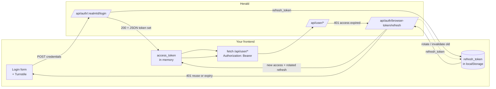

An integrator can build their own end-user frontend — register, login, account center — on their own origin with no backend of their own. The frontend authenticates against Herald with browser-held Bearer tokens issued by the `/login` endpoint, and calls `/api/user/*` directly. This is the self-built UI path, distinct from White-label branding and from the backend-mediated OAuth (BFF) path.

There is no official JS SDK for this path. The frontend talks to Herald with plain `fetch` and an `Authorization: Bearer <access_token>` header.

## Who this is for

Developers and integrators who want to self-build the entire end-user experience — register, login, password reset, account center (profile, password, 2FA, passkeys, points, subscriptions, invoices, account deletion) — on a domain they control, branded and routed their way, without standing up a backend.

This is **not** the right path if you only want to put your logo and colors on Herald's hosted auth pages — that is [White-label](/docs/ui-custom), with zero code. It is also **not** the right path if you have a backend that should mediate the token and proxy user calls through a BFF — that is [Third-Party Integration](/docs/third-party-integration), where your backend does OAuth + BFF and holds the token server-side.

## What problem it solves

Herald used to ship as one hosted frontend. The hosted pages are still available (and brandable via White-label), but Herald now also exposes the full user-facing API surface. An integrator can therefore build the whole end-user journey on their own origin — own routes, own design system, own copy, own analytics — and authenticate directly against Herald.

Login issues a browser-held Bearer token. There is **no `Set-Cookie` anywhere** on this path, so the integrator's frontend does not need to share a domain with Herald. The browser stores the tokens client-side and attaches them as a Bearer header on every call. Cross-origin access is governed by a per-Client-App origin allowlist configured by the Realm Admin.

## How it differs from the other two integration paths

| | White-label | Third-Party Integration | Custom User UI (this guide) |
|---|---|---|---|
| Who builds the UI | Herald (hosted) | Your frontend + your backend | Your frontend only |
| Code required | None | Frontend + backend | Frontend |
| Token holder | Herald's hosted frontend (in-browser) | Your backend (BFF) | The browser |
| Auth mechanism | OAuth code + PKCE → `FirstParty` token | OAuth redirect, your backend exchanges code for token | `POST /login` directly → `CustomUserUi` token in JSON |
| Domain requirement | Same-site (Herald's own origin) | OAuth redirect wiring | Any HTTPS origin in the allowlist |

Pick the simplest path that fits. If you have no backend and want full UI control, this is it.

## The credential model

Herald has two browser credential classes:

- **`FirstParty`** — Herald's own hosted frontend. Issued via Authorization Code + PKCE. Carries the user's full RBAC (admin capabilities included where the user has them).
- **`CustomUserUi`** — an integrator's self-built frontend. Issued by `POST /api/auth/{realmId}/login` directly. **Scoped to user self-service permissions only.** Admin capabilities and unknown capabilities are denied by default regardless of the URL prefix or the user's actual roles — an admin who logs in through a Custom User UI still cannot reach admin endpoints from that token.

A `CustomUserUi` token can only reach the user self-service surface under `/api/user/*`: profile, change password, TOTP bind/remove/verify, passkey register/remove/rename/verify, points, purchase, invoice, subscription, account deletion. It cannot reach `/api/admin/*` even if the underlying user is an admin.

The realm and user are derived from the token server-side. The frontend never supplies a `realmId` or `userId` on authenticated `/api/user/*` calls — the Bearer token is the sole identity. Data is scoped to the current user; one token cannot read or mutate another user's data.

CORS is **not** an auth boundary. It governs which browser origins may attach a Bearer token to a cross-origin request; the permission ceiling and per-user data scoping are enforced server-side regardless of origin.

## Prerequisites

Before writing code, the Realm Admin must configure a Client App for your frontend:

1. **Allowed origins** — list the exact HTTPS origins your frontend is served from (e.g. `https://app.example.com`). Non-wildcard, exact match. Cross-origin requests from any origin not on this list are rejected on both auth and user endpoints.
2. **Pre-registered redirect targets** — a result page URL for email verification and a result page URL for password reset. These are the only targets the public email-verify and password-reset endpoints will redirect to; arbitrary redirect URLs are rejected.
3. **Turnstile (per Client App)** — Cloudflare Turnstile is configured on the Client App, not globally. When `turnstile_enabled` is on, the frontend must render the widget, solve the challenge, and send the resulting `turnstileToken` on `/login`, `/register`, email-verify, password-reset, and the email-OTP send. The Turnstile status is keyed by `clientId`, so each Client App can have its own site key or leave Turnstile off.
4. **Enabled** — the Client App must be enabled. Disabling it later invalidates its browser token families.

The realm must also have registration and login enabled. Per-IP rate-limiting applies to all public endpoints regardless of Turnstile.

## End-to-end flow



Step by step, using plain `fetch`. Replace `<realmId>`, `<clientId>`, `<origin>`, and token placeholders with your real values.

### Register

```typescript
const res = await fetch(`https://auth.herald.example/api/auth/${realmId}/register`, {
  method: "POST",
  headers: { "Content-Type": "application/json" },
  body: JSON.stringify({
    email,
    password,
    clientId, // the Client App this UI belongs to
    turnstileToken, // from the Turnstile widget (required when Turnstile is on)
  }),
});
```

Registration is public and Turnstile-gated. On success the user must verify their email; the verification link redirects to the pre-registered result page bound to this Client App.

### Login (and the 2FA second step)

```typescript
const res = await fetch(`https://auth.herald.example/api/auth/${realmId}/login`, {
  method: "POST",
  headers: { "Content-Type": "application/json" },
  body: JSON.stringify({
    email,
    password,
    clientId, // the Client App this UI belongs to
    turnstileToken, // from the Turnstile widget
  }),
});

const body = await res.json(); // fields are camelCase
if (body.requiresTotp) {
  // 2FA path: the response carries a tempToken (e.g. "totp_login_...")
  // you use to complete the second step. No token set is issued yet.
  await secondFactorFlow(body.tempToken, body.secondFactors);
} else {
  // Token set in the JSON body. No Set-Cookie anywhere.
  storeTokens(body); // { accessToken, refreshToken, expiresIn, refreshExpiresIn, tokenType:"Bearer" }
}
```

Do **not** send `oauthClientId` / `redirectUri` / `state` on this call — those trigger the OAuth (PKCE → `FirstParty`) branch, which returns an authorization code instead of a token set. The Custom User UI path omits them so `/login` issues the `CustomUserUi` token directly.

The second-factor flow (TOTP) completes with the same token set shape. Send the `tempToken` from the first step plus the code in the body:

```typescript
const res2 = await fetch(`https://auth.herald.example/api/auth/${realmId}/login/verify-totp`, {
  method: "POST",
  headers: { "Content-Type": "application/json" },
  body: JSON.stringify({ tempToken: tempToken, code }),
});
const tokens = await res2.json(); // { accessToken, refreshToken, expiresIn, refreshExpiresIn, tokenType:"Bearer" }
storeTokens(tokens);
```

Passkey second factor follows the same two-step shape using the passkey 2FA verify endpoints (`/login/passkey/2fa/options` then `/login/passkey/2fa/verify`).

### Refresh

```typescript
async function refresh() {
  const refreshToken = localStorage.getItem("herald_refresh_token");
  const res = await fetch("https://auth.herald.example/api/auth/browser-token/refresh", {
    method: "POST",
    headers: { "Content-Type": "application/json" },
    body: JSON.stringify({ clientId: clientAppUuid, refreshToken }), // clientId is the Client App UUID
  });
  if (!res.ok) {
    // reuse detected, absolute expiry, or invalid -> family revoked
    clearTokens();
    redirectToLogin();
    return null;
  }
  const tokens = await res.json();
  storeTokens(tokens); // new access + rotated refresh; old refresh invalidated
  return tokens.accessToken;
}
```

### Logout

```typescript
await fetch("https://auth.herald.example/api/auth/logout", {
  method: "POST",
  headers: { Authorization: `Bearer ${accessToken}` },
});
clearTokens(); // drop in-memory access + localStorage refresh
```

The server call revokes the entire token family, so any leaked refresh token in the family is dead too. The frontend then clears its stored tokens.

### A sample user-self-service call (fetch profile)

```typescript
const res = await fetch("https://auth.herald.example/api/user/profile", {
  headers: { Authorization: `Bearer ${accessToken}` },
});
if (res.status === 401) {
  const retried = await refresh();
  if (!retried) return;
  return fetchProfile(retried); // retry once with the fresh token
}
return res.json();
```

The realm and user are derived from the token; no `realmId` or `userId` is sent on `/api/user/*` calls.

### A high-risk op with re-authentication (change password)

Change password, bind/remove TOTP, bind/remove Passkey, and delete account all require a short-lived, single-use re-authentication result bound to the user + client app + the specific target operation. The frontend proves the user is present again, then carries the re-auth result into the high-risk call.

```typescript
// 1. Begin re-auth for the target operation. The response lists which factors
//    the user can re-prove with (password / totp / passkey).
const r1 = await fetch("https://auth.herald.example/api/user/reauth", {
  method: "POST",
  headers: {
    "Content-Type": "application/json",
    Authorization: `Bearer ${accessToken}`,
  },
  body: JSON.stringify({ targetOperation: "change_password" }),
});
const { availableFactors } = await r1.json(); // e.g. ["password","totp"]

// 2. Verify with one of the available factors. Here, the account password.
const r2 = await fetch("https://auth.herald.example/api/user/reauth/verify", {
  method: "POST",
  headers: {
    "Content-Type": "application/json",
    Authorization: `Bearer ${accessToken}`,
  },
  body: JSON.stringify({
    targetOperation: "change_password",
    factor: "password",
    password: currentPassword,
  }),
});
const { reauthToken } = await r2.json(); // short-lived, single-use, target-bound

// 3. Carry the reauthToken in the request body of the high-risk call.
await fetch("https://auth.herald.example/api/user/change-password", {
  method: "POST",
  headers: {
    "Content-Type": "application/json",
    Authorization: `Bearer ${accessToken}`,
  },
  body: JSON.stringify({ reauthToken, newPass: newPassword }), // newPass: 8–36 chars
});
```

For TOTP, send `{targetOperation, factor: "totp", totpCode}` in step 2; for Passkey, `factor: "passkey"` with a `passkeyAssertion` object obtained from the WebAuthn ceremony. The `targetOperation` value is `snake_case` — `change_password`, `delete_account`, etc.

Renaming a Passkey does **not** require re-auth — it is a metadata-only update and goes straight through `/api/user/*` with the Bearer token.

## Token storage and refresh

The integrator owns token storage and XSS protection. Herald limits blast radius through the permission ceiling, short-lived access tokens, rotating refresh tokens, reuse detection, revocation, and re-auth for high-risk operations. The recommended split:

- **Access token → in memory** (a module-level variable). Lost on reload, but reload triggers the restore flow below.
- **Refresh token → `localStorage`**, alongside any PKCE-ish state. Survives reload so a silent refresh can restore the session.
- **Startup restore.** On boot, if `localStorage` has a refresh token and there is no in-memory access token, call `/refresh` once to restore the session.
- **Single 401 → refresh once → retry once.** Any `401` from `/api/user/*` triggers exactly one refresh; the original call is retried once with the new access token.
- **Refresh failure → clear and re-login.** If `/refresh` itself returns `401` (token reuse, absolute refresh-token-family expiry, or an invalid token), the token family has been revoked. Clear both stores and redirect to login. Do not loop.

Because the refresh token sits in `localStorage`, an XSS on your frontend can exfiltrate it. Treat XSS hygiene as a hard requirement: CSP, sanitize user-rendered HTML, audit dependencies, avoid `innerHTML` with untrusted input. The damage radius of a stolen refresh token is bounded — rotating refresh tokens, reuse detection (which revokes the family on reuse), and the user-only permission ceiling all limit what a stolen token can do — but prevention is the integrator's job.

## High-risk operations need re-authentication

These operations require a fresh re-auth result, bound to the user, the client app, and the target operation:

- change password
- bind or remove TOTP
- bind or remove Passkey
- delete account

These do **not** require re-auth:

- rename a Passkey (metadata only)
- read profile, points, invoices, subscriptions
- consume points / make purchases

The re-auth result is **short-lived** and **single-use**: it works for one call against its bound target operation and then is invalid. The user can re-prove with the account's bound password, a TOTP code, or a user-verified Passkey assertion. See the change-password example above for the three-step shape (`/api/user/reauth` → `/api/user/reauth/verify` → the protected call carrying the `reauthToken` in its body).

## CORS and allowed origins

The Realm Admin configures an allowed-origin list per Client App. Origins are matched exactly (no wildcard) and `allow_credentials` is set to `true` for the configured origins. Requests from any origin not on the list are rejected by the browser at the CORS preflight step, on both `/api/auth/*` and `/api/user/*`.

To enable a new deployment origin, the admin adds it to the Client App's allowlist in the Herald admin console. There is no wildcard support by design — each origin is an explicit trust grant.

CORS is a browser-enforced reachability check, **not** an auth boundary. The permission ceiling (`CustomUserUi` cannot reach admin endpoints) and per-user data scoping are enforced server-side on every call, regardless of origin. A request that passes CORS still fails authorization if the token lacks the scope.

## Security rules the implementation enforces

These are enforced server-side; the frontend cannot weaken them.

- **Permission ceiling.** A `CustomUserUi` token can only reach user self-service endpoints under `/api/user/*`. Admin and unknown capabilities are denied by default regardless of URL prefix or the user's actual roles.
- **Per-user data scoping.** Every `/api/user/*` call is scoped to the user identified by the token. The token cannot read or mutate another user's data; the realm and user are never client-supplied.
- **No cookie, no CSRF surface.** This path never sets an HTTP cookie. Authentication is via the Bearer header the frontend attaches, so there is no ambient credential for CSRF to ride.
- **Short-lived, rotating refresh tokens with reuse detection.** Reusing an old refresh token revokes the entire token family and forces re-login. Each successful refresh rotates the refresh token.
- **High-risk ops gated by re-auth.** Change password, bind/remove TOTP/Passkey, delete account all require a short-lived, single-use, target-bound re-auth result.
- **Passkey RP isolation.** An approved Client App HTTPS origin uses its own host as the WebAuthn RP ID. Passkey credentials are scoped per RP; existing Herald-RP passkeys are not shared with a Custom User UI origin.
- **Safe redirects.** Email verification and password reset are bound to the Client App and only redirect to pre-registered targets; arbitrary redirect URLs are rejected.
- **Client-App disable cascade.** Disabling a Client App invalidates its browser token families; outstanding access and refresh tokens stop working immediately.
- **Turnstile + rate-limiting on public endpoints.** `/login`, `/register`, email-verify, password-reset, and email-OTP send are Turnstile-gated when the Client App has `turnstile_enabled`, and rate-limited per IP regardless of Turnstile. Turnstile is configured per Client App, so each app can carry its own site key.

## Related docs

- [Custom User UI PRD](https://github.com/timzaak/herald/blob/main/docs/prd/integration/custom-user-ui.md) — product scope, business rules, acceptance goals
- [Custom User UI user stories](https://github.com/timzaak/herald/blob/main/docs/user-stories/integration/custom-user-ui.md) — acceptance scenarios
- [Third-Party Integration](/docs/third-party-integration) — the backend-mediated OAuth + BFF path
- [White-label](/docs/ui-custom) — branding Herald's hosted auth pages, no code
- [Configuration](/docs/configuration) — realm and client-app settings, including allowed origins and redirect targets
- [OpenAPI reference](/docs/openapi) — endpoint and schema details for `/api/auth/*` and `/api/user/*`
