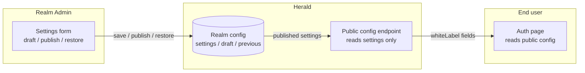

Herald lets a Realm Admin brand the hosted auth pages — logo, accent color, background, footer, and login/register copy — so end users see the tenant's brand instead of the default Herald chrome. Branding is per-Realm, covers every auth-flow page and sub-state, and falls back to the Herald defaults on any missing or broken asset.

This is a Standard White-label feature, not a full theming system. The scope matches what Auth0 / Clerk / WorkOS call "basic branding": asset URLs and color picks chosen through a form, applied to Herald's hosted auth pages. There is no custom HTML/CSS and no asset upload. (Branding the URL itself via a custom domain is a separate feature — see the [Custom Domain](/docs/realm-custom-domain) guide.)

## Who this is for

Realm Admins who want their Realm's login, register, and other auth pages to look like their product, and developers who need to understand how the branding is stored and rendered. It is not an API reference — for endpoints and schemas, see the [OpenAPI reference](/docs/openapi).

End users (Regular Users) never see the configuration surface. They only consume the result on auth pages.

## What problem it solves

Every Realm in Herald ships with the same default auth page: the "Herald" wordmark, a fixed gradient background, and Herald's button color. White-label lets the Realm Admin point at a logo URL, pick an accent color, paste a background, and publish, so every auth-flow page under that Realm carries the tenant's brand instead.

## What you can brand

All branding fields are optional. Leave a field empty and that one slot falls back to the Herald default while the rest still apply.

| Field | Effect when set | Fallback when empty or broken |
|-------|-----------------|-------------------------------|
| Logo URL | Renders as `` in the auth page header, replacing the "Herald" wordmark | The wordmark `Herald` |
| Accent color | Overrides the `--primary` / `--ring` CSS variables on the auth page subtree (buttons, links, focus rings) | The default theme primary |
| Background | `image` (a URL) or `gradient` (a `linear-gradient(...)` / `radial-gradient(...)` string), applied as the page background | The default gradient |
| Footer text | A line at the bottom of the auth page | No footer rendered |
| Login title / subtitle | Replaces the login card heading and subtext | Realm name / realm description |
| Register title / subtitle | Replaces the register card heading and subtext | The default register copy |

Logos and backgrounds are URL references, not uploads. The tenant hosts the assets on their own CDN, image host, or gradient string. Herald never stores the binary — it stores the URL and lets the browser fetch it. This keeps Herald out of the asset-hosting business but means a dead URL degrades to the fallback rather than showing a broken image.

## Realm configuration

Realm Admins configure branding under *Settings → White-label*. The tab sits next to the existing General / TOTP / Passkey / Registration / Email / Email code tabs, and reuses the same Realm-config storage, so the permission model is the same one the rest of Settings uses: reading requires `settings.view`, and saving requires `settings.manage`.

The form has the six fields above plus a live preview. The preview renders the actual `AuthPageWrapper` component with the current form values, so what you see in the preview is exactly what end users will see after publish — same logo, same accent, same fallback rules. There is a tab to flip the preview between the login layout and the register layout, because the two consume different copy fields.

### Draft, publish, restore

Saving the form does not change what end users see. That is deliberate: a half-edited brand or a mistyped accent color should not go live the moment the admin tabs away. The lifecycle is:

1. **Save draft.** Writes the in-progress config to a draft slot. End-user pages keep serving the previously published config. The form shows a "draft saved" notice.
2. **Publish.** Promotes the draft to the live config. The config that was live just before publish is copied to a previous slot, so there is always one step of undo. The draft is cleared.
3. **Discard draft.** Throws away the draft and resets the form back to the published config. End-user pages are untouched.
4. **Restore previous.** Swaps the previous slot back into the live config. The config that was live before the restore becomes the new previous slot, so restore itself is reversible one step. Gated behind a confirm dialog because it overwrites the current live config.

Only the published config is exposed to end users. Drafts and previous configs are admin-only and never appear on the public auth pages.

This is intentionally a minimal lifecycle — one draft, one previous. It is not a version history. If an admin needs to roll back more than one step, they re-enter the values by hand.

## Accent color and contrast

When the admin picks an accent color, the form computes the contrast ratio against white (`#ffffff`, the button text color) using WCAG 2.1 relative luminance. If the ratio is below 4.5:1 (WCAG 1.4.3 AA), the form shows a contrast warning next to the color input.

The warning is advisory only. The admin can still save and publish a low-contrast color. The decision belongs to the tenant, not to Herald — the render layer never re-blocks a published color. If the tenant decides their brand red is more important than the 4.5:1 ratio, Herald shows their red.

The color input accepts hex only (`#rgb`, `#rrggbb`, with alpha variants). Non-hex values are silently ignored at render time and the default primary is used, so a malformed value can't break the page.

## Fallback behavior

Every branded asset degrades to a default rather than failing visibly. This matters because the assets are external URLs the admin controls and Herald does not validate beyond a scheme check at save time.

- **Logo fails to load.** The `` `onError` flips a flag and the header swaps to the `Herald` wordmark. No broken-image icon. The rest of the brand still renders.
- **Background image fails to decode.** The image is preloaded through a hidden `Image()` before it is applied. If it does not decode, the page keeps the default gradient. The admin never sees a half-loaded background.
- **Gradient is unsafe.** Only `linear-gradient(` and `radial-gradient(` prefixes are accepted. Anything else is dropped and the default background is used. This keeps the gradient field from becoming an arbitrary CSS injection surface.
- **Config fails to parse on the backend.** A corrupt or illegally-shaped config value makes the public endpoint return an empty white-label object, so the auth page renders with full Herald defaults. The page stays usable; the failure is logged.

## Which pages get branded

Branding is applied through one shared component, `AuthPageWrapper`, that every auth-flow page already renders. The wrapper takes a `whiteLabel` prop and handles logo, accent, background, and footer. Callers pull the published config from the Realm's public config and pass it in.

The branding reaches:

- login (the main form, plus the OAuth consent, TOTP, and passkey second-factor sub-states)
- register (loading, error, disabled, and form states)
- forgot password
- reset password

Each auth route derives a single `whiteLabel` value from the public config and threads it through every sub-state, so a user moving from the login form into a TOTP prompt does not see the brand flash off and back on.

Forgot-password and reset-password apply only logo, accent, background, and footer — they do not consume the login/register copy fields, since those pages have their own wording.

Pages outside the auth flow are not branded. The legal pages, the user center, and the admin console itself keep the Herald chrome even where they share styling infrastructure.

## How the data flows

The admin mutates config through the management endpoints (draft / publish / restore). The public endpoint reads only the published `settings` slot, never draft or previous. End-user auth pages read the public endpoint and hand the result to the wrapper. Drafts and undo history stay server-side and admin-only end to end.

## Related docs

- [White-label PRD](https://github.com/timzaak/herald/blob/main/docs/prd/core/ui-custom.md) — product scope, business rules, acceptance goals
- [White-label user stories](https://github.com/timzaak/herald/blob/main/docs/user-stories/core/white-label.md) — US-WL-001..004 acceptance scenarios
- [Configuration](/docs/configuration) — Realm settings live here; white-label is one tab among them
- [OpenAPI reference](/docs/openapi) — endpoint and schema details for the management and public-config APIs
