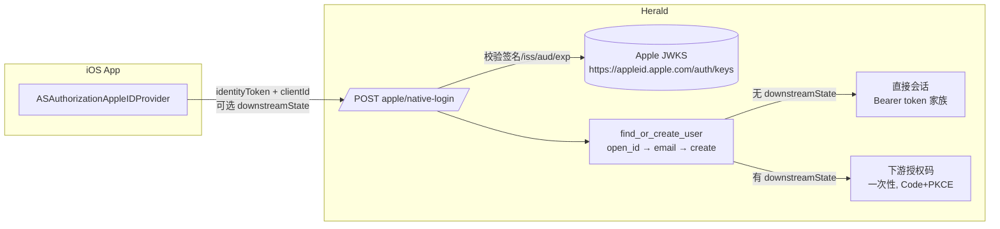

接入方的 iOS App 用苹果系统原生 SDK（`ASAuthorizationAppleIDProvider`）在 App 内拉起系统授权弹窗，拿到 Apple 签发的 `identityToken`（JWT），POST 给 Herald 校验。全程不离开 App，不走浏览器重定向。Herald 只校验凭证、不调 Apple token 端点、不接触 `client_secret`。

这是纯后端能力。Herald 自己没有 iOS App，iOS 端由接入方实现。Herald Web 控制台也没有改动——复用现有的 Apple Provider 配置（Client ID、启用状态）。

## 给谁看

在 iOS App 里接 Apple 登录的接入方开发者，以及想理解这条登录路径如何与 Apple web 跳转登录、Google One Tap 共存的开发者。这不是 API 参考——端点和 schema 细节见 [OpenAPI 参考](/docs/openapi)。

## 解决什么问题

Apple 登录此前只有 web 跳转路径（OAuth Authorization Code redirect）：用户得离开 App、跳浏览器、再回到 App。体验割裂，而且 web redirect 路径依赖 `client_secret`——它是用 Apple 私钥签发的 JWT，有运行时签发和每 6 个月续签的运维负担。

native 路径绕开这两件事。iOS App 用系统 SDK 直接拿到 `identityToken`，Herald 在服务端用 Apple JWKS 公钥校验签名、签发者、受众、有效期，确认用户身份后签发会话。App 永远不接触 Apple 私钥，Herald 也不调 Apple token 端点、不用 `client_secret`。

架构上和 [Google One Tap](/docs/zh/third-party-integration) 同构：接收上游签发的 JWT 凭证 → 服务端校验 → 用户匹配 → 双分支签发。区别只在凭证来源是 Apple 而非 Google，以及邮箱处理规则不同（见下文）。

## 前置条件

native 路径只读取现有的 Apple Provider 配置，不新增配置项：

- Realm 已配置并启用 Apple Provider（US-OE-001）。没配 → 端点返回 404 `"Apple provider not configured or not enabled"`。
- 接入方的 iOS App 在 Apple Developer 后台开启了 Sign in with Apple capability，且 App 的 Audience 与 Herald Realm 里 Apple Provider 的 Client ID（Service ID）一致。

Herald Web 控制台里 Apple Provider 的现有表单字段（Client ID、scopes、enabled）对 native 路径已足够。

## 两条会话分支

请求带不带 `downstreamState` 决定走哪条分支。这与 Google One Tap、OAuth callback 共用同一套机制。

**直接会话分支（`downstreamState` 留空）。** iOS App 对应 Herald 里一个第一方 Client App。校验通过后，Herald 按 `clientId` 签发该 App 的 Bearer token 家族（`accessToken` / `refreshToken` / `expiresIn` 等），和密码登录、OAuth callback 返回的结构一样。

**下游授权码分支（带 `downstreamState`）。** iOS App 通过 Authorization Code + PKCE 接入（第三方 Client App）。Herald 校验通过后签发一次性授权码，返回带 `?code=ac_...&state=...` 的 `redirectUri`，接入方再凭 PKCE verifier 走现有的 token 端点换令牌。

## 请求

`POST /api/oauth/{realmId}/apple/native-login`，公开端点，访问前提是 Apple `identityToken` 校验通过。

| 字段 | 类型 | 必填 | 说明 |
|---------|------|--------|------|
| `identityToken` | string | 是 | Apple 签发的 ID Token（JWT），来自 `ASAuthorizationAppleIDProvider` 回调 |
| `clientId` | string | 是 | 发起登录的 Herald Client App `client_id`，决定直接会话分支绑定的 App |
| `downstreamState` | string | 否 | 下游授权交易标识（OAuth `state`）。有 → 下游授权码分支；无 → 直接会话分支 |

直接会话分支返回 `message` + `userId` + 一组 Bearer token（`accessToken` / `refreshToken` / `expiresIn` / `refreshExpiresIn` / `tokenType`），结构和 OAuth callback 一致。下游授权码分支返回 `{ redirectUri }`，含一次性 code 和原 state。

## iOS 端要做什么

Herald 不管 iOS 端代码，这里只描述契约。iOS App 负责拉起系统弹窗、拿到 `identityToken`、决定走哪条分支、把结果提交给 Herald。

1. 用 `ASAuthorizationAppleIDProvider` 发起 `ASAuthorizationAppleIDRequest`，`requestedScopes` 按需带 `[.fullName, .email]`（邮箱和名字只在首次授权返回）。
2. 在回调里取 `ASAuthorizationAppleIDCredential.identityToken`（JWT），转成字符串。
3. 判断走哪条分支：
   - 第一方场景：直接带上 `clientId`，不带 `downstreamState`。
   - 第三方 Code+PKCE 场景：用户得先在 Herald `/authorize` 建好下游授权事务，拿到 `state`，作为 `downstreamState` 一起提交。
4. `POST` 到 `/api/oauth/{realmId}/apple/native-login`，按返回结构落会话或用 code 换令牌。

Apple 首次授权之后，后续授权恒不返回邮箱和名字。这是 Apple 的行为，Herald 的邮箱处理规则就是为这件事设计的（见下文）。

## 邮箱处理规则

Apple native 的邮箱规则和 Apple web 跳转登录**有意不同**。原因是 Apple 在非首次授权时恒不返回邮箱，如果照搬 web redirect 的"邮箱缺失就拒绝建号"，存量用户第一次走 native 就会失败。

- **Apple 中转邮箱**（`@privaterelay.appleid.apple.com`）是合法可收信地址，按真实邮箱存储，不补占位。
- **凭证没带邮箱 + 这个 Apple `sub` 没命中已有 provider 记录**（首次建号）：生成 `{sub}@apple.placeholder` 占位邮箱、标记未验证，建号。对齐微信占位邮箱的范式（`{id}@wechat.placeholder`）。
- **凭证没带邮箱 + `sub` 命中已有 provider 记录**（存量用户后续登录）：靠 `open_id` 命中，不依赖邮箱。

`account.email` 有 NOT NULL + 唯一约束，占位邮箱是为了在首次建号时满足这个约束，不阻断登录。

## 账号一致性

native 和 web 跳转用同一个匹配键：`provider_type=Apple`、`open_id=Some(claims.sub)`。所以同一个 Apple 用户从 web 跳转登录过、再走 native 登录，落到同一个 Herald 账号，不产生重复。匹配优先级和其它 OAuth 登录一致：`open_id → email → create`（Apple 不提供 union_id）。

## 失败响应

| HTTP | 条件 | 说明 |
|------|------|------|
| 400 | 请求体校验失败（缺 `identityToken` / `clientId`）；`downstreamState` 非法、已消费或绑定不匹配 | `bad_request` |
| 401 | `identityToken` 签名 / 签发者 / 受众 / 有效期校验失败 | `unauthorized`，不建号不发会话 |
| 404 | Realm 未配置或未启用 Apple Provider | `"Apple provider not configured or not enabled"` |
| 503 | Apple JWKS 不可达（基础设施异常） | `"Upstream service unavailable"`，不静默跳过校验 |

JWKS 不可达返回 503 而不是 401：401 会把上游故障错误地归咎于调用方。Herald 不会在 JWKS 拉不到时降级成"不校验签名"。

## 安全规则

这些是后端强制的行为，不是建议。

- **凭证不入日志。** tracing 只记 `realm_id`、`provider=apple`、`user_id`、失败类别；`identityToken` 明文不进任何 span 字段。
- **受众绑 Realm。** `identityToken` 的 `aud` 必须等于该 Realm Apple Provider 的 `client_id`，跨 Realm 凭证不可用。
- **`client_secret` 永不外泄。** native 路径本身不用 `client_secret`，响应和 Provider 配置读取都不触及 secret 字段。
- **会话绑定客户端。** 直接会话分支绑 `clientId` 并沿用现有 IP 绑定策略，和密码登录、OAuth callback、Google One Tap 一致。

## 和其它登录路径的关系

- **Apple web 跳转登录**（已上线）：两个入口共存，关联同一个 Apple 用户。web redirect 的 `client_secret` 自动签发缺陷独立，native 路径不依赖它也不修它。
- **Google One Tap**：架构同构（JWT 凭证 → 服务端校验 → 双分支签发）。差别是 Apple 不要求 `email_verified == true` 才放行，而是用占位邮箱策略兜底；以及 Apple `iss` 是单值 `https://appleid.apple.com`。
- **其它 Provider**（GitHub、Facebook、WeChat 等）：共存，互不影响。

## 相关文档

- [Apple native 登录 PRD](https://github.com/timzaak/herald/blob/main/docs/prd/auth/support-mobile-apple-login.md) — 产品范围、业务规则、验收目标
- [Apple native 登录用户故事](https://github.com/timzaak/herald/blob/main/docs/user-stories/auth/support-mobile-apple-login.md) — US-AL-001..003 验收场景
- [第三方后端对接](/docs/zh/third-party-integration) — 下游 Code+PKCE 和 Bearer token 的整体上下文
- [OpenAPI 参考](/docs/openapi) — 端点和 schema 细节
