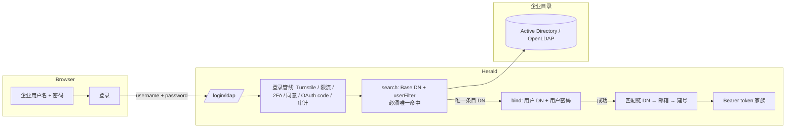

Herald 的 LDAP 登录让员工用企业目录（Active Directory、OpenLDAP 等 LDAPv3 目录）里已有的账号密码登录。Realm 管理员在 *Settings* 中配置目录连接后，登录页出现"企业账号登录"入口，首次登录自动创建没有本地密码的账号。目录只做凭据权威：Herald 不回写、不同步目录。

这是一种第一因素登录方式。员工通过目录认证后，走和密码登录完全相同的后续流程：Turnstile、限流、TOTP/Passkey 二因素、协议同意、下游授权码、会话签发，一个都不少。

## 适合谁

想把员工账号统一交给企业目录管理的 Realm 管理员，以及集成 Herald 托管登录页或自建 Custom User UI、需要了解请求结构和错误分支的开发者。这不是 API 参考，端点和 schema 细节见 [OpenAPI 参考](/docs/openapi)。

## 解决什么问题

企业员工本来就有目录账号。让他们再注册一套 Herald 密码，意味着两套凭据、两次密码管理。LDAP 登录把"验证密码"这一步交给目录，Herald 只负责账号记录和授权。

一个常见搭配是关闭 Realm 的公开自注册、让员工走目录登录。Herald 按这个场景处理首次登录：管理员启用目录就是对这份供给的授权，首次目录认证成功会自动建号，不受公开注册开关限制。

## 工作原理

两个公开端点：

1. **状态。** `GET /api/auth/{realmId}/ldap/status` 返回 `{ enabled }`。前端不需要管理员权限，据此显示或隐藏"企业账号登录"入口。未配置的 Realm 返回 `false`，不报 404。
2. **登录。** 用户提交企业用户名和密码，前端 POST 到 `/api/auth/{realmId}/login/ldap`。请求体是 `{ clientId, username, password, turnstileToken?, oauthClientId?, redirectUri?, state?, agreements? }`。

认证过程是标准的 search-then-bind：Herald 用服务账号（或匿名，如果目录允许）在 Base DN 下按用户搜索过滤器检索，必须恰好命中一条，再用这条目的 DN 加用户密码向目录做 bind。命中 0 条或多于 1 条都按认证失败处理，不会拿第一条命中的条目去猜。

密码的边界值得说清楚：企业密码只在加密信道里传输，不落任何存储，验证完就丢弃。请求校验也不套用本地密码策略（本地密码要求 8 到 36 位），因为目录密码的策略归企业管理员管，这里只做长度上限（512 字符）防滥用。

登录成功时响应和密码登录是同一套二元形态：最终成功返回 `BrowserTokenResponse`（`accessToken`/`refreshToken`/`expiresIn` 等），需要继续步骤时返回标志形态（`requiresTotp`、`consentRequired` 加协议列表、OAuth 场景的 `redirectTo` 等）。前端处理密码登录的逻辑原样复用。

错误语义：

| 状态码 | 条件 | 说明 |
|-------|------|------|
| 401 | 目录里没有这个用户、密码错误、搜索 0 命中或多于 1 条命中 | 一律泛化为 invalid credentials，和密码登录同文案，响应无法用来枚举目录里的账号 |
| 400 | Realm 未启用 LDAP | 不创建任何账号或会话 |
| 403 | 目录认证成功但 Herald 账号被禁用 | 明确提示账号已被禁用 |
| 429 | 限流命中 | 和密码登录共用同一组 IP + 标识符限流预算，阈值不因 LDAP 降低 |
| 503 | 目录不可达或超时 | 整个 search-then-bind 有 10 秒上限；响应不携带目录地址等内部细节，完整错误进 tracing 和审计 |

限流、Turnstile、二因素这些都继承自既有登录管线，前端绕不过去。

## Realm 配置

Realm 管理员在 *Settings* 的 *企业目录（LDAP）* 标签页配置。权限和 Settings 其余部分一致：读取要 `settings.view`，保存要 `settings.manage`。

配置存在两条 `configType=ldap` 的配置行里：`settings`（JSON）和 `bind_password`（服务账号密码，按敏感信息处理）。`settings` 的字段：

| 字段 | 必填 | 说明 |
|------|------|------|
| `enabled` | 是（默认 false） | 唯一的启用判定源。状态端点和登录闸门都只看它 |
| `url` | 是 | `ldap://` 或 `ldaps://` 开头的目录地址 |
| `starttls` | 否（默认 false） | `ldap://` 时必须为 true；`ldaps://` 时必须为 false |
| `baseDn` | 是 | 用户搜索的起始 DN |
| `bindDn` | 否 | 服务账号 DN，留空表示匿名搜索（需要目录允许） |
| `userFilter` | 是 | 搜索过滤模板，必须恰好包含一个 `{login}` 占位符 |
| `mailAttribute` | 否（默认 `mail`） | 目录里携带邮箱的属性名 |

保存时的校验是硬规则：不加密的连接（`ldap://` 且未开 StartTLS）直接拒绝保存，因为企业密码只允许在加密信道中传输。过滤器要求括号配平、`{login}` 恰好一个，用户输入的用户名会被转义后才填入，不能拼出注入。

两个真实的过滤器写法：

- Active Directory：`(&(objectClass=user)(sAMAccountName={login}))`，配 `ldaps://ldap.example.com:636` 和 `dc=example,dc=com`。
- OpenLDAP：`(&(objectClass=inetOrgPerson)(uid={login}))`，配 `ldap://` 加 StartTLS，比如仓库测试环境用的 `dc=herald,dc=test`。

`bind_password` 的读取恒为掩码（`configValue` 返回 null），保存时留空表示保留已存的密码。表单上"填写服务账号 DN 并启用前，需先保存服务账号密码"的拦截就是这个语义。

还有一个字段 `caCertPem`：目录用自签 CA 签发证书时，可以提交 PEM 格式的 CA 证书包（最多 32KB），信任会叠加在系统信任之上而不是替换它。这个字段只能通过 configs API 设置，Settings 表单里没有输入项。

## 首次登录建号

第一次目录认证成功时，Herald 按三级顺序匹配账号：目录身份（用户条目 DN）→ 邮箱 → 创建。目录身份记录在身份链接表里（类型 `ldap`），再次登录命中同一个账号。

- 目录返回的邮箱由企业管理员在目录里维护，视为可信来源。员工先用邮箱注册过 Herald 账号、后来接目录，首次目录登录会关联到既有账号，不产生重复账号。
- 目录没有邮箱属性时，用基于 DN 哈希的占位邮箱建号（`@ldap.placeholder` 域，不标记已验证）。后续登录按目录身份命中，不依赖邮箱。
- 建号的账号没有本地密码。在密码登录表单里拿这个账号的邮箱加任意密码登录会得到和密码错误一致的泛化失败；用户自己设置了本地密码之后，密码登录才恢复可用。
- Realm 要求协议同意时，建号前会先返回 `consentRequired` 分支，用户同意后前端带着协议版本重新提交，同意记录在账号创建之前完成。

建号不受公开注册开关限制，理由见前文：启用目录即供给授权。

## 和其他登录方式的关系

LDAP 是并行的第一因素选项，不禁用其他入口：

- 密码、邮箱验证码、Passkey 第一因素照常可用。管理员停用目录后入口消失、登录请求返回 400，已建的账号和已绑定的其他登录方式不受影响。
- TOTP 和 Passkey 二因素照常触发。绑定了 TOTP 的用户走企业账号登录，先过目录认证，再完成 TOTP。
- 从第三方应用发起登录时，请求带上 `oauthClientId`、`redirectUri`、`state`，认证完成后走既有的授权码分支，第三方应用拿到 token 的方式和密码登录场景一致。
- 登录成功签发的 token 家族和其他方式同构：refresh 轮换、复用检测、撤销语义都一样。

前端层面，登录页按状态端点 fail-closed 显隐入口（`enabled === true` 才渲染，查询失败也不显示）。浏览器端集成走 web SDK 的 `loginWithLdap`，它和 `login` 返回同一套结果结构。

Turnstile 按 Client App 配置执行，和邮箱验证码登录相同，见 [Custom User UI](/docs/custom-user-ui)。

## 明确不做的事

这些是边界，不是待办：

- 不做 LDAP 组到 Herald 角色/权限的映射，不做后台目录同步。有需求时独立立项。
- 不做 Windows 桌面单点登录（SPNEGO/Kerberos），只有登录页表单认证。
- 每个 Realm 一个目录配置，不支持多目录故障转移。
- 不缓存目录凭据。目录不可达时企业账号登录就是不可用（503），员工走其他登录方式，管理员可以在 Settings 里停用目录止血。
- 不代理修改目录里的密码。企业密码的修改和重置走企业目录自己的渠道，Herald 不写目录。

## 相关文档

- [邮箱验证码登录](/docs/auth-email-otp) — 另一种替代第一因素，状态端点和登录页显隐是同一套模式
- [Custom User UI](/docs/custom-user-ui) — 自建前端路径，包括 Turnstile 渲染和 token 存储
- [配置](/docs/configuration) — Realm 设置和配置行的通用读写
- [OpenAPI 参考](/docs/openapi) — `ldap_login`、`ldap_status` 端点的细节和 schema
