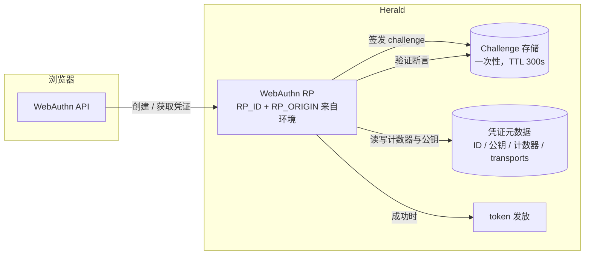

Herald 的 Passkey 基于 WebAuthn / FIDO2。同一个凭证既能作为无密码的第一因素（conditional UI），也能在密码登录后作为第二因素。密码和 TOTP 始终保留为回退方式，设备丢失或浏览器不支持都不会让用户被锁死。

## 给谁看

需要理解或在 Realm 里启用 Passkey 的开发者和 Realm 管理员。覆盖：Passkey 在 Herald 里做什么、两种登录模式怎么运作、Realm 策略和用户设备管理怎么配、实现强制了哪些安全规则。这不是 API 参考，端点和 schema 见 [OpenAPI 参考](/docs/openapi)。

## 解决什么问题

Passkey 是留在用户设备上的公钥凭证：私钥不离开设备，断言绑定到 origin（RP_ID），所以一个长得像的钓鱼域名页面无法产出有效断言。Passkey 是 TOTP 之外的额外选项——不替换 TOTP，两者都保留为回退方式。

## 两种登录模式

一个 Passkey 凭证同时服务两种模式。这是有意的设计：注册了 Passkey 的用户不用想"这是登录凭证还是 2FA 凭证"——它两者都是。

**第一因素（无密码）。** 登录页上，用户名输入框聚焦时浏览器会自动填充该浏览器上已注册的可发现凭证（conditional UI），或者用户点 *Use Passkey*。服务器签发一次性断言 challenge，设备签名，成功后直接签发 Bearer token——全程不输密码。

**第二因素。** 用户输入邮箱和密码。密码验证通过后，如果用户已注册 Passkey，Herald 在 TOTP 旁并列提供一个 Passkey 验证步骤。用户完成 ceremony，签发 Bearer token。这个模式和现有 TOTP 第二因素流程平行。

两种模式成功后走的是同一条 token 发放路径，和 TOTP 一致。

## Realm 配置

Realm 管理员在 *Settings → Security* 控制 Passkey。配置复用 TOTP 已有的 Realm-config 存储，不需要单独学一套 Passkey 设置面。

| 设置项 | 含义 |
|---------|---------|
| `enabled` | 本 Realm 是否提供 Passkey。关 → 注册入口和登录选项都隐藏 |
| `force_enabled` | 开启后，未注册 Passkey 的用户下次登录被引导注册。回退到密码 / TOTP 仍然保留，用户不会因缺设备或浏览器不支持被锁死 |
| `user_verification` | `preferred` 或 `required`。对本 Realm 下所有注册和认证 ceremony 生效 |
| `cross_platform_authenticator` | 是否接受漫游 authenticator（YubiKey、手机作为跨设备凭证）。默认允许，以兼容常见的同步 passkey 生态（iCloud Keychain、Google Password Manager） |

用户已注册后再禁用 Passkey 是平滑降级：新注册被挡住，但已有凭证继续可用，这些用户仍可回退到密码 / TOTP。没有人被强制弃用现有 Passkey。

## 用户设备管理

用户可注册多个 Passkey，在 *Profile → Security* 管理。每个凭证带：

- 设备名（默认如 "iCloud Keychain" 或 authenticator 名称，用户可改）
- 注册时间和最近使用时间
- 是否为可同步 passkey（sync passkey）

重命名和删除都支持。删除**最后一个** Passkey 有明确风险提示：用户必须确认理解此后只能用密码 / TOTP 登录。被删除的凭证立即失效；如果它是最后一个，conditional UI 不再为该用户出现。

Passkey 注册要先确认当前密码，和现有安全敏感操作的约定一致。

## 回退与降级

Herald 不实现"纯无密码"模式。每个 Passkey 入口都保留回退：

- 登录页始终可点 *Use password instead*。
- 浏览器不支持 WebAuthn 时，隐藏 Passkey 入口，只显示密码 / TOTP 登录。
- Passkey ceremony 失败时，统一提示 "Passkey 验证失败"，提供重试和回退到密码——不暴露具体哪一步失败，避免泄露。
- `force_enabled` 下，未注册 Passkey 的用户被引导注册，但仍可跳过用密码 / TOTP。

TOTP 启用后，本身是密码登录后的一个回退方式。两者作为并列的第二因素选项呈现，不是按优先级排序的链。

## 实现强制了哪些安全规则

这些不是建议，后端会拒绝违反它们的 ceremony。

- **Challenge 一次性且短命。** 每次注册和认证的 challenge 有效期 5 分钟（300 秒），无论成功失败，消费后立即删除。
- **校验 origin 和 RP_ID。** 断言的 origin 必须匹配部署的 `RP_ID` / `RP_ORIGIN`。它们来自环境配置，不硬编码，同一份构建可服务不同部署域名。
- **计数器单调递增。** 每次认证成功更新存储的计数器，非递增值被拒，用于检测凭证克隆。
- **服务端只存元数据。** 服务器保留凭证 ID、COSE 公钥、计数器、transports、aaguid、backup eligibility/state、用户起的昵称。私钥不离开用户设备，也不在服务端持久化。
- **不泄露失败原因。** 验证失败返回单一通用消息。
- **速率限制。** Passkey 注册和认证端点适用与现有登录 / 认证端点一致的速率限制策略。
- **审计。** 关键事件写入审计日志：注册成功、删除凭证、Realm 策略变更（含强制模式变更）、Passkey 登录成功 / 失败。

## 数据流

第一因素和第二因素两条路径复用同一个 RP、challenge 存储和凭证存储；区别只在于 ceremony 跑在密码验证之前还是之后，以及 challenge 锚定到哪个临时会话键。

## 相关文档

- [Passkey PRD](https://github.com/timzaak/herald/blob/main/docs/prd/auth/passkey.md) — 产品范围、业务规则、验收目标
- [Passkey 用户故事](https://github.com/timzaak/herald/blob/main/docs/user-stories/auth/passkey.md) — US-PK-001..010 验收场景
- [TOTP 教程上下文](/docs/configuration) — TOTP 是共享的回退方式，Realm 安全配置在此
- [OpenAPI 参考](/docs/openapi) — 端点和 schema 细节
