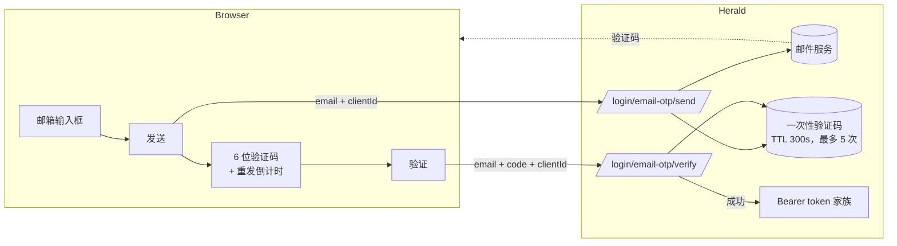

Herald 的邮箱验证码登录让用户输入发送到邮箱的一次性验证码即可登录，不需要密码。Realm 管理员在 *Settings* 中开启，并可以设置让全新邮箱在首次登录时自动注册。验证码有效期短、尝试次数有限，并按邮箱和按 IP 限速。密码、TOTP、Passkey 仍然作为备选保留。

这是一种第一因素登录方式，不是第二因素。TOTP 和 Passkey 仍然是密码登录之后的第二因素选项。邮箱验证码登录对选择它的用户完全替代了密码这一步。

## 适合谁

想提供免密码登录的 Realm 管理员，以及集成 Herald 托管登录页或自建 Custom User UI、需要了解请求结构和端点分支的开发者。这不是 API 参考——端点和 schema 细节见 [OpenAPI 参考](/docs/openapi)。

## 解决什么问题

有些用户不想管理密码，有些 Realm 根本不希望存储密码。邮箱验证码登录用“用户能收到邮件”这件事替换了一个需要记住的秘密。代价是邮件服务商成为信任链的一部分，登录时邮箱必须可达。Herald 保留密码、TOTP、Passkey 作为备选，开启邮箱验证码不会锁死任何人。

## 工作原理

流程是两个无需认证的步骤：

1. **发送。** 用户输入邮箱，前端把它 POST 到 `/api/auth/{realmId}/login/email-otp/send`。如果该邮箱属于一个激活的账号，或者开启了自动注册，Herald 会发送一个 6 位验证码。响应里带 `expiresInSeconds`，前端可以据此显示倒计时。
2. **验证。** 用户输入验证码，前端把 `{ email, code, clientId }` POST 到 `/api/auth/{realmId}/login/email-otp/verify`。成功时响应是一个 `BrowserTokenResponse`（和密码登录返回的结构相同），前端用同样的方式存储 token。

公开端点 `GET /api/auth/{realmId}/email-otp/status` 返回 `{ enabled }`，前端不需要管理员权限就能据此隐藏或显示邮箱验证码入口。

无论邮箱是否已有账号、或该账号是否处于激活状态，send 都返回 `200`——已注册但被禁用的账号也会返回 200 且不发验证码，因此响应不能用来枚举哪些邮箱存在。send 仅有的非 200 响应是下面 *Realm 配置* 里描述的两类 409（`email_not_registered`、`consent_required`）。

两个请求里的 `clientId` 是这次登录所属的 Client App。它决定了 Turnstile 的 site key（Turnstile 按 Client App 配置）、限速桶，以及签发哪个浏览器 token 家族。

## Realm 配置

Realm 管理员在 *Settings → Security* 下、TOTP 和 Passkey 旁边的 *Email code* 标签页里开启邮箱验证码。权限模型和 Settings 其余部分一致：读取需要 `settings.view`，保存需要 `settings.manage`。

| 设置项 | 含义 |
|---------|---------|
| `enabled` | 是否在该 Realm 的登录页显示邮箱验证码入口。关闭 → 入口隐藏，send/verify 端点返回 400 拒绝 |
| `autoRegister` | 当有人输入一个没有账号的邮箱时怎么处理。开启 → 第一次验证码验证成功就创建账号并登录（受下面的同意门控约束）。关闭 → send 返回 409 `email_not_registered`，前端可以引导用户显式注册 |

发邮件依赖 Realm 在 *Settings → Email* 下配置了邮件服务商。如果没配置，验证码无法发送；此时开启邮箱验证码会让入口可见但 send 一直失败。

### 同意门控（自动注册）

当 `autoRegister` 开启、且 Realm 要求同意法律文件（条款、隐私政策）时，一个全新邮箱的第一次 send 会返回 409，带 `code: "consent_required"` 和需要同意的协议列表——此时不会发送验证码。前端展示协议，用户同意后，前端带着同意的协议版本重新 send。只有到这一步才会发送验证码，而验证成功既创建账号也记录同意。

这样保证同意在账号创建之前完成。用户不会在没同意必要协议的情况下得到一个自动注册的账号。

## 限制和限速

这些都在服务端强制执行，前端无法绕过。

| 限制项 | 取值 |
|-------|-------|
| 验证码有效期 | 300 秒（5 分钟） |
| 每个验证码的最大验证次数 | 5 |
| 发送限速，按邮箱 | 60 秒内 2 次 |
| 发送限速，按 IP | 60 秒内 5 次 |
| 验证限速，按邮箱 | 60 秒内 5 次 |
| 验证限速，按 IP | 60 秒内 10 次 |

输错 5 次后验证码失效，用户需要重新请求。验证成功会消费掉验证码，不能重放。

## 和其他登录方式的关系

邮箱验证码是一个并行的第一因素选项。它不会禁用密码、TOTP 或 Passkey：

- **密码登录** 仍然可用。有密码的用户仍然可以用密码登录。
- **TOTP 和 Passkey** 是密码登录 *之后* 运行的第二因素。邮箱验证码登录不要求也不触发它们——它本身已经是单因素登录。
- **Passkey 第一因素**（conditional UI）是另一条免密路径。两者可以同时开启，登录页会分别显示各自的入口。

用户通过邮箱验证码登录后，拿到和其他登录方式一样的 `BrowserTokenResponse` 结构，以及一样的 token 家族语义（轮换 refresh、复用检测、撤销）。

## Turnstile

当 Client App 开启了 `turnstile_enabled` 时，send 受 Turnstile 保护。前端渲染组件、完成挑战，并在 send 请求体里带上生成的 `turnstileToken`。verify 不需要新的 Turnstile token。Turnstile 如何按 Client App 配置见 [Custom User UI](/docs/zh/integration/custom-user-ui)。

## 相关文档

- [Custom User UI](/docs/zh/integration/custom-user-ui) — 自建前端路径，包括如何渲染 Turnstile 组件和存储拿到的 token
- [White-label](/docs/zh/customization/branding) — 给 Herald 托管的登录页做品牌定制，邮箱验证码入口也会出现在这些页面上
- [Passkey 认证](/docs/zh/auth/passkey) — 另一种免密码的第一因素选项
- [配置](/docs/zh/configuration) — Realm 安全设置
- [OpenAPI 参考](/docs/openapi) — send、verify、status 端点的细节和 schema
