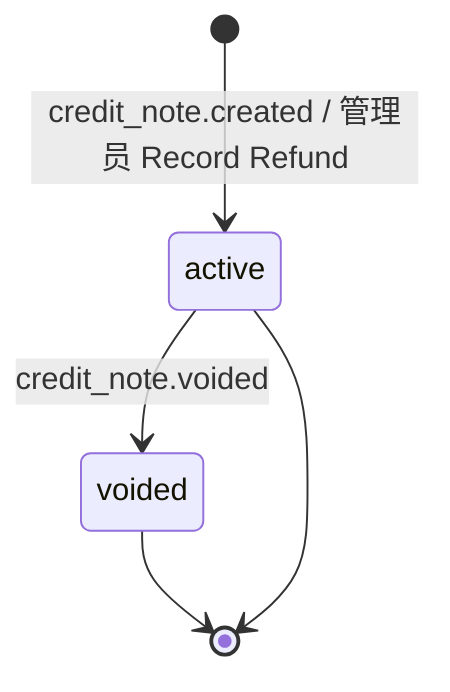

Herald 的发票系统支持三种来源：Stripe 外部同步、Creem MoR 同步、Herald 自研（manual）。Credit Note 用来在发票层面记录退款凭证，让发票的"已退款金额"和"剩余应付"与真实收款保持一致。

Stripe 发票的退款流程分两层：Charge 层的 Refund 由 `charge.refunded` 处理积分回收；Invoice 层的 Credit Note 由 `credit_note.created` / `credit_note.voided` 处理发票金额。本功能只讨论后者。Creem 作为 Merchant of Record，税务合规由 Creem 负责，Herald 不维护 Credit Note。Manual 发票的线下退款由 Realm Admin 主动创建 Manual Credit Note。

## 给谁看

负责 Herald 计费模块的开发者、Realm Admin，以及需要理解发票退款数据流的后端/前端开发者。

## Credit Note 的生命周期

一条 Credit Note 有两个字段决定它的业务含义：

- `source`：`stripe` 或 `manual`。Stripe 由 webhook 同步；Manual 由管理员创建。
- `status`：`active` 或 `voided`。active 表示退款已生效，会从发票剩余应付中扣除；voided 表示 Stripe 端作废了该 Credit Note，金额会加回发票剩余应付。

Manual Credit Note 一旦创建就是 `active`，且不可撤销、不可删除。如果记错了，只能通过线下补偿或客服渠道处理。



发票主状态机不受影响，仍然是 `draft / issued / paid / void / overdue`。Credit Note 只在 `paid` 发票上叠加"已退款 / 剩余应付"两个派生展示维度。

## 数据模型

核心实体定义在 `backend/domain/src/billing/credit_note.rs`：

```rust
pub struct CreditNote {
    pub id: Uuid,
    pub invoice_id: Uuid,
    pub realm_id: String,
    pub amount: i64,              // 最小货币单位，必须 > 0
    pub currency: String,
    pub source: CreditNoteSource, // Stripe | Manual
    pub status: CreditNoteStatus, // Active | Voided
    pub external_credit_note_id: Option<String>, // 仅 Stripe
    pub memo: Option<String>,     // 仅 Manual
    pub created_by_user_id: Option<Uuid>, // 仅 Manual
    pub created_at: DateTime<Utc>,
}
```

发票表缓存了两个派生值：

- `amount_refunded`：累计退款金额
- `amount_remaining`：剩余应付，等于 `total - amount_refunded`

写入时由 repository 方法在事务内同时更新 `credit_note` 表和发票的这两个字段，避免列表查询时做 JOIN 聚合。

## Stripe Credit Note 同步

### 触发事件

需要在 Stripe Dashboard 配置 webhook，让 Herald 接收以下事件：

- `credit_note.created`：创建 Credit Note，状态为 `active`
- `credit_note.voided`：将 Credit Note 置为 `voided`，回滚金额

事件处理在 `backend/api-billing/src/stripe_webhook_handlers.rs`。

### 幂等与乱序处理

Stripe 可能重复发送事件，也可能先发送 `credit_note.voided` 再发送 `credit_note.created`。

处理规则：

- `credit_note.created` 以 `stripe_credit_note_id` 为唯一键。重复事件更新已有记录，不重复累加金额。
- `credit_note.voided` 先查本地记录。已 `voided` 的直接跳过；不存在的返回 500 错误触发 Stripe 重投递，等待 `created` 事件先到。
- 本地找不到关联发票时记录 Warn 日志并跳过，由补偿 Job 后续补处理。

### 补偿 Job

`backend/worker/src/jobs/webhook_compensation_job.rs` 已把 `credit_note.created` 和 `credit_note.voided` 纳入 Stripe 事件补偿清单。当 webhook 缺失时，Job 会从 Stripe Events API 拉取近期事件并补处理。

## Manual Credit Note 记录退款

### 入口

Realm Admin 在发票详情页点击 **Record Refund**，填写金额和原因后提交。

按钮只在同时满足以下条件时显示：

- `provider = manual`
- 发票状态为 `paid`
- 当前用户有 `billing.manage` 权限

### 约束

- 金额必须为正整数，单位是最小货币单位（分）。
- 单笔金额不能超过发票当前剩余应付。
- 累计退款金额不能超过发票总额。
- 仅 `provider = manual` 的发票可以创建。对 Stripe 或 Creem 发票创建会返回 403，提示 "Refunds for this provider are managed externally"。

创建成功后，发票详情立即展示退款摘要和 Manual Credit Note 列表。

### 与发票作废的关系

如果一张 manual 发票已经存在 active Credit Note，管理员不能再 void 该发票。`void_invoice` 会检查 active Credit Note 并返回 409：

```text
Invoice cannot be voided while it has active refund credit notes
```

只有 voided 状态的 Credit Note 不会阻断作废，因为它们只是审计凭证。

## 前端展示

### 管理员视角

发票列表新增 **Refunded** 列。当 `amountRefunded > 0` 且 `provider` 是 stripe 或 manual 时，显示来源色 chip（Stripe 为 teal，Manual 为 cyan）。`provider = creem` 的行显示 em dash。

发票详情页在费用汇总下方展示：

- **Total**：发票总额
- **Refunded**：累计已退款（红色负值）
- **Remaining**：剩余应付

如果累计退款超过总额，会显示 destructive alert，提示管理员去 Stripe Dashboard 核对或审计 Manual 记录。

详情页同时展示双轨 Credit Note 列表：

- **Manual 轨**：编号、原因、操作者、开具时间、状态、金额。底部有 **Record Refund** 按钮。
- **Stripe 轨**：编号、开具时间、状态、金额。只读，脚注提示"Read-only · managed in Stripe Dashboard"。

voided 的 Credit Note 整行带删除线，但 `Voided` Badge 保持可读。

### 用户视角

普通用户在自己的发票列表和详情中只能看到退款摘要（如 "Refunded 30/100"），看不到 Credit Note 列表、内部编号和操作者信息。`provider = creem` 的发票不展示任何退款维度。

## 常见边界

| 场景 | 处理方式 |
|------|---------|
| 累计退款超过发票总额（Stripe 侧） | 记录 Error 日志，不自动修复 |
| 累计退款超过发票总额（Manual 侧） | 创建时直接拒绝 |
| 对 Stripe/Creem 发票创建 Manual Credit Note | 403 拒绝 |
| 对非 `paid` 发票创建 Manual Credit Note | 400 拒绝 |
| `credit_note.voided` 时本地无记录 | 返回 500 触发 Stripe 重投递 |
| `credit_note.created` 时本地无关联发票 | Warn 日志跳过，等补偿 Job |
| 发票已存在 active Credit Note 时 void | 409 拒绝 |

## 相关文档

- `docs/prd/billing/notes.md` — Credit Note 产品需求
- `docs/user-stories/billing/invoice-fallback.md` — US-IF-007 ~ US-IF-011
- [发票主流程](/docs/zh/billing/invoice)
- [Stripe 支付与 Webhook](/docs/zh/billing/stripe-payment)
- `docs/prd/billing/webhook-compensation.md` — Webhook 补偿机制
