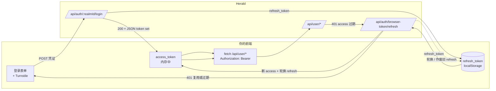

集成方可以在自己的 origin 上自建整套终端用户前端——注册、登录、账户中心——而不需要自己的后端。前端通过 `/login` 端点拿到浏览器持有的 Bearer token 直接调用 `/api/user/*`。这是自建 UI 路径，区别于 White-label 品牌化，也区别于后端中转的 OAuth（BFF）路径。

这条路径**没有官方 JS SDK**。前端用普通 `fetch` 加 `Authorization: Bearer <access_token>` 头与 Herald 交互。

## 给谁看

想把整套终端用户体验——注册、登录、密码重置、账户中心（资料、密码、2FA、Passkey、积分、订阅、发票、注销账户）——建在自己控制的域名上，用自有路由、自有设计系统、自有文案、自有埋点，且不想为此起一个后端的开发者与集成方。

如果你只是想在 Herald 托管的 auth 页面上换成自己的 logo 和配色——那是 [White-label](/docs/zh/ui-custom)，零代码——这条路径不适合你。如果你已经有后端，希望由后端中转 token、把用户调用代理成一个 BFF——那是 [Third-Party Integration](/docs/zh/third-party-integration)，由你的后端做 OAuth + BFF 并在服务端持有 token——这条路径同样不适合你。

## 解决什么问题

Herald 过去只交付一套托管前端。这套托管页面仍然存在（并可通过 White-label 做品牌化），但 Herald 现在还暴露了完整的面向用户的 API 面。因此集成方可以在自己的 origin 上构建完整的终端用户旅程——自有路由、自有设计系统、自有文案、自有埋点——并直接向 Herald 认证。

登录会签发一个浏览器持有的 Bearer token。这条路径上**完全没有 `Set-Cookie`**，所以集成方的前端不需要与 Herald 共享域名。浏览器在客户端存储 token，并在每次调用时以 Bearer 头附上。跨域访问由 Realm 管理员按 Client App 配置的 origin 允许清单治理。

## 与另外两条集成路径的区别

| | White-label | Third-Party Integration | Custom User UI（本指南） |
|---|---|---|---|
| 谁来搭 UI | Herald（托管） | 你的前端 + 你的后端 | 仅你的前端 |
| 是否需要写代码 | 不需要 | 前端 + 后端 | 前端 |
| 谁持有 token | Herald 自家托管前端（浏览器内） | 你的后端（BFF） | 浏览器 |
| 认证机制 | OAuth code + PKCE → `FirstParty` token | OAuth 跳转，后端用 code 换 token | 直接 `POST /login` → JSON 返回 `CustomUserUi` token |
| 域名要求 | 同站（Herald 自家 origin） | OAuth 跳转接线 | 允许清单内的任意 HTTPS origin |

选最贴合需求的最简路径。如果你没有后端又想要完整的 UI 控制权，就是这条。

## 凭证模型

Herald 有两类浏览器凭证：

- **`FirstParty`**——Herald 自家的托管前端。通过 Authorization Code + PKCE 签发。携带用户的完整 RBAC（在用户拥有相应角色的前提下包含管理能力）。
- **`CustomUserUi`**——集成方自建的前端。通过 `POST /api/auth/{realmId}/login` 直接签发。**仅限用户自助权限范围。** 管理能力和未知能力默认拒绝，无论 URL 前缀如何、无论用户实际拥有什么角色——管理员通过 Custom User UI 登录，该 token 依然无法触达管理端点。

`CustomUserUi` token 只能触达 `/api/user/*` 下的用户自助面：资料、改密、TOTP 绑定/解绑/校验、Passkey 注册/解绑/改名/校验、积分、下单、发票、订阅、注销账户。即便底层用户是管理员，也无法触达 `/api/admin/*`。

Realm 和用户由 token 在服务端推导出来。前端在已认证的 `/api/user/*` 调用上**绝不**传 `realmId` 或 `userId`——Bearer token 是唯一身份。数据按当前用户隔离；一个 token 无法读写或改动其他用户的数据。

CORS **不是**认证边界。它只决定哪些浏览器 origin 可以带着 Bearer token 发起跨域请求；权限上限和按用户的数据隔离无论 origin 如何都在服务端强制执行。

## 前置条件

在写代码之前，Realm 管理员必须为你的前端配置一个 Client App：

1. **允许的 origin**——列出你的前端实际托管的精确 HTTPS origin（如 `https://app.example.com`）。不支持通配，精确匹配。不在清单内的 origin 发起的跨域请求，在 auth 端点和 user 端点上都会被拒绝。
2. **预注册的跳转目标**——一个邮箱验证结果页 URL，一个密码重置结果页 URL。公开的邮箱验证和密码重置端点只会跳转到这两个目标；任意跳转 URL 都会被拒绝。
3. **Turnstile（按 Client App 配置）**——Cloudflare Turnstile 配置在 Client App 上，不是全局配置。开启 `turnstile_enabled` 后，前端必须渲染组件、完成挑战，并在 `/login`、`/register`、邮箱验证、密码重置以及邮箱验证码 send 请求里带上生成的 `turnstileToken`。Turnstile 状态按 `clientId` 查询，所以每个 Client App 可以用自己的 site key，也可以各自关闭 Turnstile。
4. **已启用**——该 Client App 必须处于启用状态。后续禁用会使它的浏览器 token 家族失效。

Realm 还必须启用注册和登录。按 IP 的限速对所有公开端点生效，与是否开启 Turnstile 无关。

## 端到端流程



逐步展开，使用普通 `fetch`。把 `<realmId>`、`<clientId>`、`<origin>` 以及 token 占位符换成你的真实值。

### 注册

```typescript
const res = await fetch(`https://auth.herald.example/api/auth/${realmId}/register`, {
  method: "POST",
  headers: { "Content-Type": "application/json" },
  body: JSON.stringify({
    email,
    password,
    clientId, // 本 UI 所属的 Client App
    turnstileToken, // 来自 Turnstile 组件（开启 Turnstile 时必填）
  }),
});
```

注册是公开端点，受 Turnstile 保护。成功后用户必须验证邮箱；验证链接会跳转到绑定该 Client App 的预注册结果页。

### 登录（以及 2FA 第二步）

```typescript
const res = await fetch(`https://auth.herald.example/api/auth/${realmId}/login`, {
  method: "POST",
  headers: { "Content-Type": "application/json" },
  body: JSON.stringify({
    email,
    password,
    clientId, // 本 UI 所属的 Client App
    turnstileToken, // 来自 Turnstile 组件
  }),
});

const body = await res.json(); // 字段为 camelCase
if (body.requiresTotp) {
  // 2FA 路径：响应带一个 tempToken（形如 "totp_login_..."），
  // 用它完成第二步。此时还未签发 token set。
  await secondFactorFlow(body.tempToken, body.secondFactors);
} else {
  // token set 在 JSON body 里。全程没有 Set-Cookie。
  storeTokens(body); // { accessToken, refreshToken, expiresIn, refreshExpiresIn, tokenType:"Bearer" }
}
```

这个调用**不要**传 `oauthClientId` / `redirectUri` / `state`——这些会触发 OAuth（PKCE → `FirstParty`）分支，返回授权码而非 token set。Custom User UI 路径省略它们，`/login` 才会直接签发 `CustomUserUi` token。

第二步（TOTP）用同样的 token set 形状收尾。把第一步拿到的 `tempToken` 连同验证码放进 body：

```typescript
const res2 = await fetch(`https://auth.herald.example/api/auth/${realmId}/login/verify-totp`, {
  method: "POST",
  headers: { "Content-Type": "application/json" },
  body: JSON.stringify({ tempToken: tempToken, code }),
});
const tokens = await res2.json(); // { accessToken, refreshToken, expiresIn, refreshExpiresIn, tokenType:"Bearer" }
storeTokens(tokens);
```

Passkey 第二因素走同样的两步形状，使用 passkey 2FA verify 端点（`/login/passkey/2fa/options` 再 `/login/passkey/2fa/verify`）。

### 刷新

```typescript
async function refresh() {
  const refreshToken = localStorage.getItem("herald_refresh_token");
  const res = await fetch("https://auth.herald.example/api/auth/browser-token/refresh", {
    method: "POST",
    headers: { "Content-Type": "application/json" },
    body: JSON.stringify({ clientId: clientAppUuid, refreshToken }), // clientId 是 Client App 的 UUID
  });
  if (!res.ok) {
    // 复用检测、绝对到期或无效 -> token 家族被吊销
    clearTokens();
    redirectToLogin();
    return null;
  }
  const tokens = await res.json();
  storeTokens(tokens); // 新 access + 轮换后的 refresh；旧 refresh 失效
  return tokens.accessToken;
}
```

### 登出

```typescript
await fetch("https://auth.herald.example/api/auth/logout", {
  method: "POST",
  headers: { Authorization: `Bearer ${accessToken}` },
});
clearTokens(); // 清掉内存里的 access 和 localStorage 里的 refresh
```

服务端这次调用会吊销整个 token 家族，因此家族里任何泄露的 refresh token 也同时作废。随后前端清掉自己存储的 token。

### 一个用户自助调用示例（拉取资料）

```typescript
const res = await fetch("https://auth.herald.example/api/user/profile", {
  headers: { Authorization: `Bearer ${accessToken}` },
});
if (res.status === 401) {
  const retried = await refresh();
  if (!retried) return;
  return fetchProfile(retried); // 用新 token 重试一次
}
return res.json();
```

Realm 和用户由 token 推导；`/api/user/*` 调用上不传 `realmId` 或 `userId`。

### 一个需要重新认证的高危操作（改密）

改密、绑定/解绑 TOTP、绑定/解绑 Passkey、注销账户都需要一个短时、一次性、且绑定到「用户 + Client App + 目标操作」的重新认证结果。前端再次证明用户在场，然后把重认证结果带进高危调用。

```typescript
// 1. 为目标操作发起重认证。响应列出用户可以用哪些因子再次证明
//    （password / totp / passkey）。
const r1 = await fetch("https://auth.herald.example/api/user/reauth", {
  method: "POST",
  headers: {
    "Content-Type": "application/json",
    Authorization: `Bearer ${accessToken}`,
  },
  body: JSON.stringify({ targetOperation: "change_password" }),
});
const { availableFactors } = await r1.json(); // 如 ["password","totp"]

// 2. 用可用因子之一校验。这里用账户密码。
const r2 = await fetch("https://auth.herald.example/api/user/reauth/verify", {
  method: "POST",
  headers: {
    "Content-Type": "application/json",
    Authorization: `Bearer ${accessToken}`,
  },
  body: JSON.stringify({
    targetOperation: "change_password",
    factor: "password",
    password: currentPassword,
  }),
});
const { reauthToken } = await r2.json(); // 短时、一次性、绑定目标

// 3. 把 reauthToken 放进高危调用的请求 body。
await fetch("https://auth.herald.example/api/user/change-password", {
  method: "POST",
  headers: {
    "Content-Type": "application/json",
    Authorization: `Bearer ${accessToken}`,
  },
  body: JSON.stringify({ reauthToken, newPass: newPassword }), // newPass：8–36 字符
});
```

TOTP 用第 2 步发 `{targetOperation, factor: "totp", totpCode}`；Passkey 用 `factor: "passkey"` 加上 WebAuthn ceremony 拿到的 `passkeyAssertion` 对象。`targetOperation` 的取值是 `snake_case`——`change_password`、`delete_account` 等。

给 Passkey 改名**不需要**重认证——它只是元数据更新，直接通过 `/api/user/*` 带 Bearer token 调用即可。

## token 的存储与刷新

token 的存储和 XSS 防护由集成方负责。Herald 通过权限上限、短时 access token、轮换 refresh token、复用检测、吊销、以及高危操作的重认证来限制爆炸半径。推荐的拆分方式：

- **access token → 内存中**（模块级变量）。刷新页面时会丢失，但刷新会触发下面的恢复流程。
- **refresh token → `localStorage`**，外加任何 PKCE 类状态。在页面重载后存活，从而能通过静默 refresh 恢复会话。
- **启动恢复。** 启动时，如果 `localStorage` 里有 refresh token 而内存里没有 access token，调用一次 `/refresh` 恢复会话。
- **单次 401 → 刷新一次 → 重试一次。** `/api/user/*` 的任何 `401` 都只触发一次刷新；原调用用新 access token 重试一次。
- **刷新失败 → 清除并重新登录。** 如果 `/refresh` 本身返回 `401`（token 复用、refresh token 家族绝对过期或 token 无效），整个家族已被吊销。清空两个存储并跳转登录页。不要循环。

由于 refresh token 存在 `localStorage`，你的前端一旦出现 XSS，攻击者就能把它偷走。请把 XSS 防护当作硬性要求：CSP、对用户渲染的 HTML 做转义、审计依赖、避免用不可信输入拼 `innerHTML`。被盗 refresh token 的危害半径是被限制的——轮换 refresh token、复用检测（复用即吊销家族）以及仅限用户权限的上限，都缩小了被盗 token 能做的事——但预防仍然是集成方的职责。

## 高危操作需要重新认证

以下操作要求一个新的重认证结果，且绑定到用户、Client App 和目标操作：

- 改密
- 绑定或解绑 TOTP
- 绑定或解绑 Passkey
- 注销账户

以下**不**需要重认证：

- 给 Passkey 改名（仅元数据）
- 读取资料、积分、发票、订阅
- 消费积分 / 下单

重认证结果是**短时**且**一次性**的：只能对它所绑定的目标操作发一次调用，之后失效。用户可以用账户绑定的密码、TOTP 验证码、或已做用户校验的 Passkey assertion 来再次证明身份。改密示例给出了三步式形状（`/api/user/reauth` → `/api/user/reauth/verify` → 受保护调用，把 `reauthToken` 放进它的 body）。

## CORS 与允许的 origin

Realm 管理员按 Client App 配置允许的 origin 清单。origin 精确匹配（无通配），并对配置的 origin 设置 `allow_credentials` 为 `true`。不在清单内的 origin 发起的请求，会在 CORS 预检阶段被浏览器拒绝，`/api/auth/*` 和 `/api/user/*` 皆然。

要启用一个新的部署 origin，管理员在 Herald 管理台把它加到 Client App 的允许清单里。设计上不支持通配——每一个 origin 都是一份显式的信任授予。

CORS 是浏览器层面的可达性检查，**不是**认证边界。权限上限（`CustomUserUi` 不能触达管理端点）和按用户的数据隔离，在每次调用上都在服务端强制执行，与 origin 无关。一个通过了 CORS 的请求，如果 token 缺少权限，依然会在鉴权环节失败。

## 实现强制执行的安全规则

以下规则在服务端强制执行，前端无法削弱：

- **权限上限。** `CustomUserUi` token 只能触达 `/api/user/*` 下的用户自助端点。管理和未知能力默认拒绝，无论 URL 前缀或用户实际角色如何。
- **按用户的数据隔离。** 每次 `/api/user/*` 调用都限定在 token 所标识的用户范围内。token 无法读写或改动其他用户的数据；realm 和 user 永远不由客户端传入。
- **无 cookie、无 CSRF 面。** 这条路径从不设置 HTTP cookie。认证依赖前端附上的 Bearer 头，因此没有可供 CSRF 搭车的环境凭证。
- **短时、轮换的 refresh token + 复用检测。** 复用旧 refresh token 会吊销整个 token 家族，强制重新登录。每次成功刷新都会轮换 refresh token。
- **高危操作需重认证。** 改密、绑定/解绑 TOTP/Passkey、注销账户都要求一个短时、一次性、绑定目标的重认证结果。
- **Passkey RP 隔离。** 已批准的 Client App HTTPS origin 以自身主机作为 WebAuthn RP ID。Passkey 凭证按 RP 隔离；既有的 Herald-RP passkey 不与 Custom User UI origin 共享。
- **安全跳转。** 邮箱验证和密码重置都绑定到 Client App，只会跳转到预注册的目标；任意跳转 URL 都会被拒绝。
- **Client App 禁用级联。** 禁用一个 Client App 会使它的浏览器 token 家族失效；既有的 access 和 refresh token 立即失效。
- **公开端点的 Turnstile + 限速。** `/login`、`/register`、邮箱验证、密码重置、邮箱验证码 send 在 Client App 开启 `turnstile_enabled` 时受 Turnstile 保护，并无论是否开启 Turnstile 都按 IP 限速。Turnstile 按 Client App 配置，每个应用可以有自己的 site key。

## 相关文档

- [Custom User UI PRD](https://github.com/timzaak/herald/blob/main/docs/prd/integration/custom-user-ui.md)——产品范围、业务规则、验收目标
- [Custom User UI 用户故事](https://github.com/timzaak/herald/blob/main/docs/user-stories/integration/custom-user-ui.md)——验收场景
- [Third-Party Integration](/docs/zh/third-party-integration)——后端中转的 OAuth + BFF 路径
- [White-label](/docs/zh/ui-custom)——品牌化 Herald 托管 auth 页面，零代码
- [Configuration](/docs/zh/configuration)——realm 与 client-app 设置，包括允许的 origin 和跳转目标
- [OpenAPI 参考](/docs/openapi)——`/api/auth/*` 与 `/api/user/*` 的端点和 schema 细节
