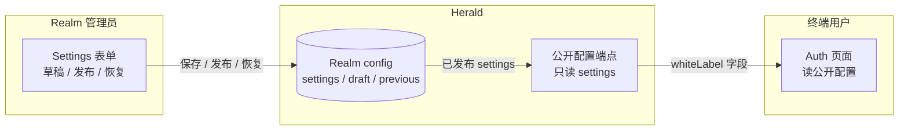

Herald 允许 Realm 管理员对托管的 auth 页面做品牌化——logo、主色、背景、页脚文案、登录/注册页文案——让终端用户看到的是租户自己的品牌而不是默认的 Herald 外观。品牌化按 Realm 隔离，覆盖所有 auth 流页面及其子状态，任一资产缺失或失效都回退到 Herald 默认值。

这是 Standard White-label 能力，不是完整的主题系统。范围对标 Auth0 / Clerk / WorkOS 所说的 "basic branding"：通过表单填入资产 URL 和颜色选择，应用到 Herald 托管的 auth 页面。不提供自定义 HTML/CSS、资产上传。（通过自定义域名品牌化 URL 本身是独立功能——见 [自定义域名](/docs/zh/realm-custom-domain) 指南。）

## 给谁看

想让本 Realm 的登录、注册及其他 auth 页面看起来像自家产品的 Realm 管理员，以及需要理解品牌化如何存储和渲染的开发者。这不是 API 参考，端点和 schema 见 [OpenAPI 参考](/docs/openapi)。

终端用户（Regular User）永远看不到配置入口，只在 auth 页面消费品牌化的结果。

## 解决什么问题

Herald 里每个 Realm 默认都用同一套 auth 页面：「Herald」文字 logo、固定渐变背景、Herald 的按钮主色。White-label 让 Realm 管理员指向一个 logo URL、选一个主色、贴一段背景、发布，之后该 Realm 下所有 auth 流页面都带上租户品牌。

## 可以品牌化哪些内容

所有品牌字段都可选。某字段留空，该位置回退到 Herald 默认，其余已填字段照常生效。

| 字段 | 设置后的效果 | 空或失效时的回退 |
|------|--------------|------------------|
| Logo URL | 在 auth 页头部渲染为 ``，替换「Herald」文字 logo | `Herald` 文字 |
| 主色（accent color） | 覆盖 auth 页子树的 `--primary` / `--ring` CSS 变量（按钮、链接、聚焦环） | 默认主题主色 |
| 背景 | `image`（图片 URL）或 `gradient`（`linear-gradient(...)` / `radial-gradient(...)` 字符串），作为页面背景 | 默认渐变 |
| 页脚文案 | auth 页底部一行文字 | 不渲染页脚 |
| 登录标题 / 副标题 | 替换登录卡片的标题和副标题 | Realm 名称 / Realm 描述 |
| 注册标题 / 副标题 | 替换注册卡片的标题和副标题 | 默认注册文案 |

Logo 和背景是 URL 引用，不是上传。租户把资产放在自己的 CDN、图床或渐变字符串上。Herald 不存二进制，只存 URL，由浏览器去拉。这让 Herald 不介入资产托管，但也意味着 URL 失效时降级到回退值，而不是显示破损图片。

## Realm 配置

Realm 管理员在 *Settings → White-label* 配置品牌化。这个 Tab 和现有的 General / TOTP / Passkey / Registration / Email / Email code 等 Tab 并列，复用同一套 Realm-config 存储，所以权限模型与 Settings 其他部分一致：读取要 `settings.view`，保存要 `settings.manage`。

表单包含上面六个字段加一个实时预览。预览渲染的是真正的 `AuthPageWrapper` 组件，用表单当前值，所以预览看到的就是发布后终端用户会看到的——同样的 logo、主色、回退规则。预览有登录和注册两个 Tab 可切换，因为两者消费不同的文案字段。

### 草稿、发布、恢复

保存表单不会改变终端用户看到的内容。这是有意的：编辑到一半的品牌配置或打错的主色不应该在管理员切走瞬间就上线。生命周期如下：

1. **保存草稿。** 把进行中的配置写入草稿槽。终端用户页面继续服务此前已发布的配置。表单显示「草稿已保存」提示。
2. **发布。** 把草稿提升为线上配置。发布前一刻的线上配置被复制到 previous 槽，所以始终有一步撤销可用。草稿被清空。
3. **放弃草稿。** 丢弃草稿，表单重置回已发布配置。终端用户页面不受影响。
4. **恢复上一版。** 把 previous 槽换回线上配置。恢复前一刻的线上配置成为新的 previous 槽，所以恢复本身也是一步可逆。因为它会覆盖当前线上配置，所以前面有确认对话框。

只有已发布配置会暴露给终端用户。草稿和 previous 配置仅管理员可见，永远不会出现在公开的 auth 页面上。

这是有意保持的最小生命周期——一个草稿、一个 previous。它不是版本历史。管理员需要回退超过一步时，手动重新填值。

## 主色与对比度

管理员选主色时，表单用 WCAG 2.1 相对亮度算法计算该色对白色（`#ffffff`，按钮文字色）的对比度。如果比值低于 4.5:1（WCAG 1.4.3 AA），颜色输入框旁会显示对比度警告。

警告只是提示。管理员仍然可以保存并发布一个低对比度的颜色。决定权在租户，不在 Herald——渲染层绝不会对已发布的颜色二次拦截。如果租户认为自家品牌红比 4.5:1 比值更重要，Herald 就显示他们的红色。

颜色输入只接受 hex（`#rgb`、`#rrggbb`，含 alpha 变体）。非 hex 值在渲染时被静默忽略，使用默认主色，所以畸形值不会弄坏页面。

## 回退行为

每个品牌资产都降级到默认值，而不是可见地报错。这点重要，因为资产是管理员控制的外部 URL，Herald 除了保存时做 scheme 校验外不做进一步验证。

- **Logo 加载失败。** `` 的 `onError` 翻转一个标记，头部切换到 `Herald` 文字。不显示破损图片图标。其余品牌资产照常渲染。
- **背景图片解码失败。** 图片在应用前通过隐藏的 `Image()` 预加载。如果解码不出来，页面保留默认渐变。管理员永远看不到半加载的背景。
- **渐变不安全。** 只接受 `linear-gradient(` 和 `radial-gradient(` 前缀。其他都被丢弃，使用默认背景。这避免渐变字段成为任意 CSS 注入面。
- **后端配置解析失败。** 损坏或非法结构的配置值会让公开端点返回空 white-label 对象，auth 页按完整的 Herald 默认值渲染。页面保持可用，失败被记录日志。

## 哪些页面会被品牌化

品牌化通过一个共享组件 `AuthPageWrapper` 应用，每个 auth 流页面本来就在渲染它。这个 wrapper 接收一个 `whiteLabel` prop，负责处理 logo、主色、背景、页脚。调用方从 Realm 的 public config 取出已发布配置，传进去。

品牌化覆盖：

- 登录（主表单，以及 OAuth 同意、TOTP、passkey 第二因素的子状态）
- 注册（loading、error、disabled、form 状态）
- 忘记密码
- 重置密码

每个 auth 路由从 public config 派生一个单一的 `whiteLabel` 值，贯穿所有子状态，所以用户从登录表单进入 TOTP 提示时不会看到品牌闪烁消失再出现。

忘记密码和重置密码只应用 logo、主色、背景、页脚——它们不消费登录/注册文案字段，因为这些页面有自己的措辞。

auth 流之外的页面不做品牌化。legal 页、用户中心、管理后台本身保留 Herald 外观，即使技术上共享部分样式基础设施。

## 数据怎么流转

管理员通过管理端端点修改配置（草稿 / 发布 / 恢复）。公开端点只读已发布的 `settings` 槽，绝不读 draft 或 previous。终端用户 auth 页面读公开端点，把结果交给 wrapper。草稿和撤销历史全程留在服务端，仅管理员可见。

## 相关文档

- [White-label PRD](https://github.com/timzaak/herald/blob/main/docs/prd/core/ui-custom.md) — 产品范围、业务规则、验收目标
- [White-label 用户故事](https://github.com/timzaak/herald/blob/main/docs/user-stories/core/white-label.md) — US-WL-001..004 验收场景
- [Configuration](/docs/configuration) — Realm 设置在此，white-label 是其中一个 Tab
- [OpenAPI 参考](/docs/openapi) — 管理端与公开配置 API 的端点和 schema 细节
